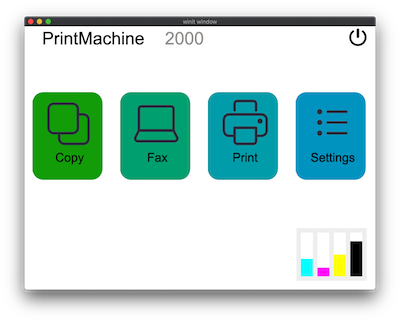
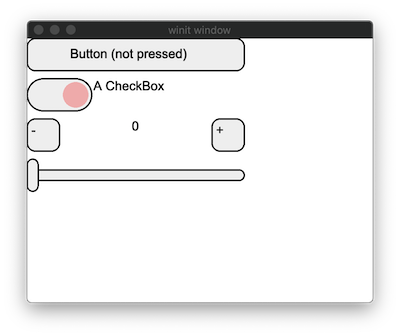
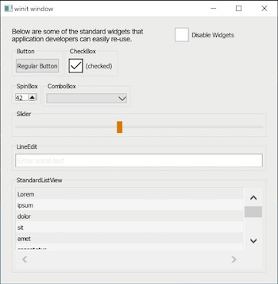
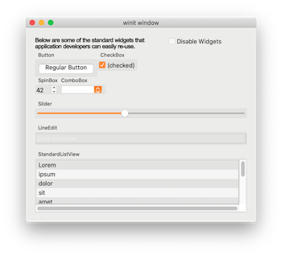
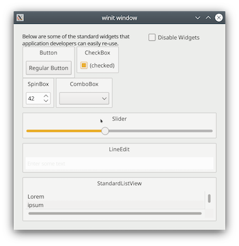

# SixtyFPS

[](https://github.com/sixtyfpsui/sixtyfps/actions)

SixtyFPS is a toolkit to efficiently develop fluid graphical user interfaces for any display: embedded devices and desktop applications. We support multiple programming languages, such as
Rust, C++, and JavaScript.

*Note: SixtyFPS is still in the **early development stage**. Some APIs may change as we are still in the
midst of developing our key features. Consequently this code is not yet ready for use in production.*


Our design goals are:

 - **Lightweight**: Fit into a few hundred kilobytes of RAM and require little processing power.
 - **Straightforward**: Programmers and designers should feel productive and be able to enjoy the design and development process.
   The APIs should be consistent, easy to use, and intuitive, no matter the target language. High-quality documentation
   should describe the APIs, teach concepts and how to use them.
 - **Native**: We support many different target platforms, from embedded devices to desktops including mobile and web. Both the user and the developer should feel at
   home on each platform. The look and feel and experience should match the users' expectations of a
   native application.

### Current Status

It's possible to create user interfaces from C++, Rust, or NodeJS. These user interfaces can be compiled and
shown on Linux, macOS, Windows, and in Web Browsers (using WebAssembly). You can also try out SixtyFPS using
our [experimental online editor](https://sixtyfps.io/editor).

We plan to support the development of this project through dual-licensing and services. We seek feedback
from potential customers or users.

## Reference

Refer to the README of each language directory in the `api` sub-folder:

 * [SixtyFps-cpp](api/sixtyfps-cpp) ([Documentation](https://www.sixtyfps.io/docs/cpp))
 * [SixtyFps-rs](api/sixtyfps-rs) ([Documentation](https://www.sixtyfps.io/docs/rust/sixtyfps/))
 * [SixtyFps-node](api/sixtyfps-node)

The [examples](/examples) folder contains examples and demos. The `docs` folder contains [build instructions](docs/building.md) and [internal developer docs](docs/development.md).


## Demos running in WebAssembly Simulation

Click on the screenshot to see the WebAssembly simulation

| Printer Demo | Widget Gallery |
|--------------|----------------|
| [](https://www.sixtyfps.io/demos/printerdemo/) | [](https://www.sixtyfps.io/demos/gallery/) |

### Desktop native controls

| Windows | macOS | Linux |
|---------|-------|-------|
|  |  |  |

## The .60 Markup Language

SixtyFPS comes with a markup language that is specifically designed for user interfaces. This language provides a
powerful way to describe graphical elements, their placement, and the flow of data through the different states. It is a familar syntax to describe the hierarchy of elements and property bindings. Here's the obligatory "Hello World":

```60
HelloWorld := Window {
    width: 400lx;
    height: 400lx;

    Text {
       y: parent.width / 2;
       x: parent.x + 200lx;
       text: "Hello, world";
       color: blue;
    }
}
```

Check out the [language reference](docs/langref.md) for more details.

## Architecture

An application is composed of the business logic written in Rust, C++, or JavaScript and the `.60` user interface design markup, which
is compiled to native code.


### Compiler

The `.60` files are compiled ahead of time. The expressions in the `.60` are pure functions that the
compiler can optimize. For example, the compiler could choose to "inline" properties and remove those
that are constant or unchanged. In the future we hope to improve rendering time on low end devices by
pre-processing images and text. The compiler could determine that a `Text` or an `Image` element is
always on top of another `Image` in the same location. Consequently both elements could be rendered ahead
of time into a single element, thus cutting down on rendering time.

The compiler uses the typical compiler phases of lexing, parsing, optimisation, and finally code
generation. It provides different backends for code generation in the target language. The C++ code
generator produces a C++ header file, the Rust generator produces Rust code, and so on. An interpreter
for dynamic languages is also included.

### Runtime

The runtime library consists of an engine that supports properties declared in the `.60` language.
Components with their elements, items, and properties are laid out in a single memory region, to reduce
memory allocations.

Rendering backends and styles are configurable at compile time. Current there are two backends:

 * The `gl` backend uses OpenGL ES 2.0 for rendering.
 * The `qt` backend uses Qt's QStyle to achieve native looking widgets. In the future it could also use
   QPainter.

## Contributions

We welcome your contributions: in the form of code, bug reports or feedback.

 * If you see an [RFC tag](https://github.com/sixtyfpsui/sixtyfps/labels/rfc) on an issue, feel free to
   chime in.
 * For contribution guidelines see [CONTRIBUTING.md](CONTRIBUTING.md). The dual-licensing requires the
   contributor to accept a CLA.

## License

This software is provided under a dual licensing scheme:

 - **GNU GPLv3**: Open source license ideal for free software.
 - **Commercial SixtyFps license**: More details to come.

## Contact us

Feel free to join [Github discussions](https://github.com/sixtyfpsui/sixtyfps/discussions) for general chat or questions. Use [Github issues](https://github.com/sixtyfpsui/sixtyfps/issues) to report public suggestions or bugs.

To contact us privately send an email to info@sixtyfps.io
