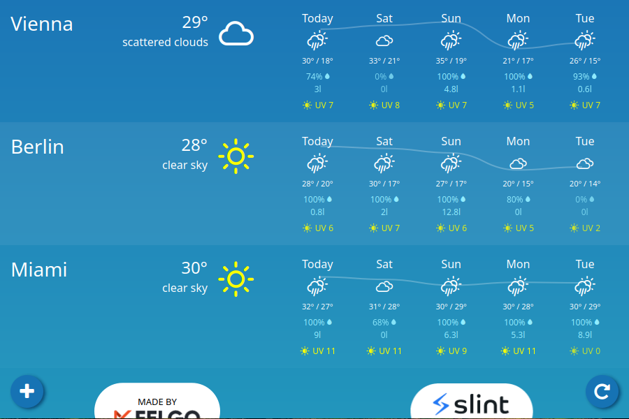

<!-- Copyright © SixtyFPS GmbH <info@slint.dev> ; SPDX-License-Identifier: MIT -->

# Demos

These demos showcase different complex use-cases for building UIs with Slint.


| Thumbnail  | Description | Demo |
| --- | --- | --- |
| [Printer UI ](./printerdemo) |  A fictional user interface for the touch screen of a printer. <br/> [Project...](./printerdemo) | [Wasm Demo](https://slint.dev/snapshots/master/demos/printerdemo/) |
| [Energy Meter](./energy-monitor/) |  A fictional user interface of a device that monitors energy consumption in a building. <br/> [Project...](./energy-monitor) | [Wasm Demo](https://slint.dev/snapshots/master/demos/energy-monitor/) |
| [Weather](./weather-demo/) | A simple, cross-platform (Desktop, Android, Wasm) weather application using real weather data from the [OpenWeather](https://openweathermap.org/) API. <br/> [Project...](./weather-demo/) | [Wasm Demo](https://slint.dev/snapshots/master/demos/weather-demo/) |
| [Usecases ](./usecases) |  Different example use cases in one app. <br/> [Project...](./usecases) | [Wasm Demo](https://slint.dev/snapshots/master/demos/usecases/) |

---
### Running the Rust Demos

You can run the examples either by going into folder or into the rust sub-folder and use `cargo run`, for example:

```sh
cd demos/printerdemo/rust
cargo run --release
```

or you can run them from anywhere in the Cargo workspace by name:

```sh
cargo run --release --bin printerdemo
```

---
### Wasm builds

In order to make the wasm build of the example, you first need to edit the Cargo.toml
files to uncomment the line starting with `#wasm#` (or use the `sed` line bellow)
You can then use wasm-pack (which you may need to obtain with `cargo install wasm-pack`).
This will generate the wasm in the `./pkg` directory, which the `index.html` file will open.
Since wasm files cannot be served from `file://` URL, you need to open a wab server to serve
the content

```sh
cd demos/printerdemo/rust
sed -i "s/^#wasm# //" Cargo.toml
wasm-pack build --release --target web
python3 -m http.server
```

---
### Running the C++ Examples

* **When compiling Slint from sources:** If you follow the [C++ build instructions](/docs/building.md#c-build), this will build the C++
examples as well by default
* **From [installed binary packages](/api/cpp/README.md#binary-packages):** Simply run cmake in one of the example directory containing a CMakeLists.txt

 ```sh
 mkdir build && cd build
 cmake -GNinja -DCMAKE_PREFIX_PATH="<path to installed>" ..
 cmake --build .
 ```

---
### Running the Node Examples

You can run the examples by going into the node sub-folder and use [`pnpm`](https://pnpm.io), for example:

```sh
cd demos/printerdemo/node
pnpm install
pnpm start
```
