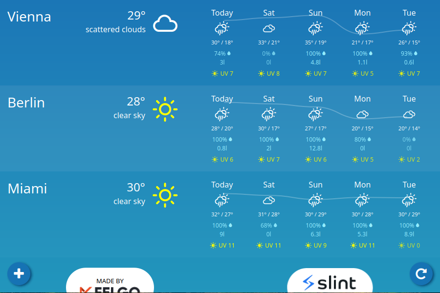
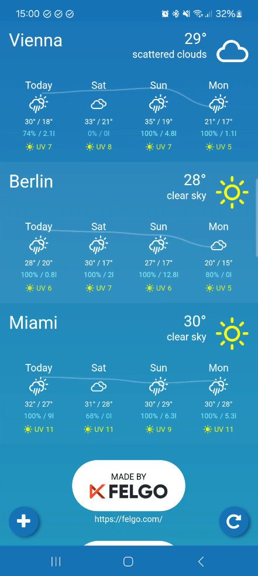

<!-- Copyright © SixtyFPS GmbH <info@slint.dev> ; SPDX-License-Identifier: MIT -->

# Weather Demo

A simple, cross-platform (Desktop, Android, Wasm) weather application using real weather data from the [OpenWeather](https://openweathermap.org/) API.

| `.slint` Design | Rust Source (Desktop) | Rust Source (Android / Wasm) | Online wasm Preview | Open in SlintPad |
| --- | --- | --- | --- | --- |
| [`main.slint`](./weather-demo/ui/main.slint) | [`main.rs`](./weather-demo/src/main.rs) | [`lib.rs`](./weather-demo/src/lib.rs) | [Online simulation](https://slint.dev/snapshots/master/demos/weather-demo/) | [Preview in Online Code Editor](https://slint.dev/snapshots/master/editor?load_url=https://raw.githubusercontent.com/slint-ui/slint/master/demos/weather-demo/ui/main.slint) |

Weather Demo is a weather application made by [Felgo](https://felgo.com/).

The application retrieves weather data from the [OpenWeather](https://openweathermap.org/) API to provide:
* Real-time weather data,
* 8-day forecasts data,
* Temperatures at particular times of the day,
* Daily rain amount and rain probability,
* UV index level,
* support for various locations around the globe.

 The project demonstrates how to write a cross-platform Rust GUI application using the [Slint](https://slint.dev/) toolkit.
 It includes subjects like:
 * responsive layouts and adaptions for different screen sizes and orientations,
 * providing fully customized look and feel with custom widgets,
 * integrating Slint code with the Rust backend code,
 * using `async` features with a Slint-based application and combining it with the Tokio runtime.

<br />
<p>
  
  
</p>

## Weather data
To enable real weather data from the [OpenWeather](https://openweathermap.org/) API, you must enable the `open_weather` feature and provide the `OPEN_WEATHER_API_KEY` environment variable with your API key at build time. The [OpenCall API](https://openweathermap.org/price#onecall) subscription is required.

If you do not enable the feature or provide the key, the application loads the dummy data instead.

**Note:** You cannot use real weather data for the WebAssembly target.

# Supported platforms

## Desktop
The application runs on all desktop platforms (Windows, Linux and macOS).

To start the application, execute:

```
cargo run
```

## Android
To be able to compile the application for Android, you must follow an initial setup. The instruction is available in [Slint's documentation](https://releases.slint.dev/latest/docs/rust/slint/android/#building-and-deploying).

***Note:*** To build `openssl` for Android, you must ensure that the proper development libraries are available in the system and provided in the `PATH` variable.

To start the application, execute:

```
cargo apk run --lib
```

## WebAssembly
It is also possible to embed the application in a web page. You need to install the `wasm-pack` crate for this.

```
cargo install wasm-pack
```

To build the application, execute:

```
wasm-pack build --target web --out-dir <output-dir>/pkg
```

To run locally:

```
cp <source-dir>/index.html <output-dir>/   # you can also provide your HTML file
cd <output-dir> & python3 -m http.server
```

Now, you can access the application at http://localhost:8000/.
