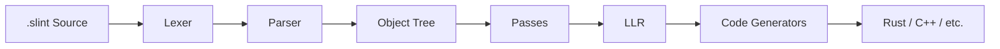
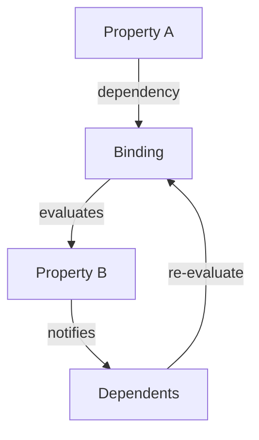

## Architecture Overview

This section provides a high-level overview of Slint's internal architecture for developers contributing to the project.

### Compiler Pipeline

The Slint compiler transforms `.slint` source files into target language code through these stages:



| Stage | Location | Description |
|-------|----------|-------------|
| **Lexer** | `internal/compiler/lexer.rs` | Tokenizes `.slint` source into tokens |
| **Parser** | `internal/compiler/parser.rs` | Builds syntax tree from tokens |
| **Object Tree** | `internal/compiler/object_tree.rs` | High-level IR representing components and elements |
| **Passes** | `internal/compiler/passes/` | ~50 transformation and optimization passes |
| **LLR** | `internal/compiler/llr/` | Low-Level Representation for code generation |
| **Generators** | `internal/compiler/generator/` | Target-specific code generators (Rust, C++, etc.) |

### Compiler Passes

Passes are organized into three phases in `internal/compiler/passes.rs`:

**1. Import Passes** (`run_import_passes`)
- `inject_debug_hooks` - Add debugging support
- `infer_aliases_types` - Resolve type aliases
- `resolving` - Resolve expressions, types, and references
- `purity_check` - Verify function purity
- `check_expressions` - Validate expression semantics

**2. Transformation Passes** (main `run_passes`)
- `lower_*` passes - Transform high-level constructs (states, layouts, popups, etc.)
- `inlining` - Inline components as needed
- `collect_*` passes - Gather globals, structs, subcomponents
- `focus_handling` - Set up focus navigation
- `default_geometry` - Calculate default sizes

**3. Optimization Passes**
- `const_propagation` - Propagate constant values
- `remove_aliases` - Eliminate property aliases
- `remove_unused_properties` - Dead code elimination
- `deduplicate_property_read` - Optimize property access
- `optimize_useless_rectangles` - Remove unnecessary elements

### Property Binding & Propagation

Slint's reactive property system is implemented in `internal/core/properties.rs`:



**Key concepts:**
- **Properties** (`Property<T>`) hold values and track dependencies
- **Bindings** are expressions that compute property values
- **Dependency tracking** uses a doubly-linked list (`DependencyListHead`/`DependencyNode`)
- When a property changes, all dependent bindings are marked dirty and re-evaluated

The binding evaluation is lazy - properties are only recomputed when read after being marked dirty.

### Backend Selection

The backend selector (`internal/backends/selector/`) chooses the platform abstraction at runtime.

**Environment Variable: `SLINT_BACKEND`**

| Value | Description |
|-------|-------------|
| `qt` | Qt backend (native look, requires Qt) |
| `winit` | Winit backend (cross-platform, default on most systems) |
| `winit-femtovg` | Winit with FemtoVG OpenGL renderer |
| `winit-skia` | Winit with Skia renderer |
| `winit-software` | Winit with software renderer |
| `linuxkms` | Direct Linux KMS/DRM (embedded systems) |
| `testing` | Testing backend (headless) |

**Default Priority** (when `SLINT_BACKEND` is not set):
1. **Qt** - if `i-slint-backend-qt` feature is enabled and Qt is available
2. **Winit** - if `i-slint-backend-winit` feature is enabled
3. **LinuxKMS** - on Linux with `i-slint-backend-linuxkms` feature

**Verifying the Active Backend:**
Currently, there's no built-in way to query which backend is active at runtime. Check the features enabled in your `Cargo.toml` and any `SLINT_BACKEND` environment variable.

## Build Configuration

### Renderer Selection

Choose a renderer based on your requirements:

| Renderer | Feature Flag | Use When | Trade-offs |
|----------|-------------|----------|------------|
| **FemtoVG** | `renderer-femtovg` | Default desktop apps | OpenGL-based, good quality, moderate performance |
| **Skia** | `renderer-skia` | High-performance graphics, complex effects | Larger binary, best quality |
| **Skia OpenGL** | `renderer-skia-opengl` | Force OpenGL on Skia | Explicit graphics API control |
| **Skia Vulkan** | `renderer-skia-vulkan` | Modern GPUs, Linux/Windows | Better performance on compatible hardware |
| **Software** | `renderer-software` | Embedded, no GPU, MCU | CPU-based, works everywhere, slower for complex UIs |

**Example Cargo.toml configurations:**

```toml
# Desktop with Skia (high quality)
slint = { version = "x.y", default-features = false, features = ["std", "backend-winit", "renderer-skia"] }

# Embedded/MCU (no GPU)
slint = { version = "x.y", default-features = false, features = ["renderer-software"] }

# Minimal Linux X11 only
slint = { version = "x.y", default-features = false, features = ["std", "backend-winit-x11", "renderer-femtovg"] }
```

### Backend Feature Flags (Linux)

On Linux, use these features to control window system support:

| Feature | Description | When to Use |
|---------|-------------|-------------|
| `backend-winit` | Both X11 and Wayland | Default - works on any Linux desktop |
| `backend-winit-x11` | X11 only | Smaller binary, X11-only deployments |
| `backend-winit-wayland` | Wayland only | Smaller binary, Wayland-only deployments |
| `backend-qt` | Qt backend | Native look, requires Qt installation |
| `backend-linuxkms` | Direct KMS/DRM | Embedded Linux without display server |

### Verifying Active Backend and Renderer

**At compile time:** Check which features are enabled in your `Cargo.toml`.

**At runtime:**
1. Check the `SLINT_BACKEND` environment variable
2. Look for initialization messages in stderr (failed backends log warnings)
3. Use the testing backend (`SLINT_BACKEND=testing`) to verify your app works without a display

**Debugging backend selection:**
```sh
# Force a specific backend
SLINT_BACKEND=winit-software cargo run

# If a backend fails, you'll see messages like:
# "Could not load rendering backend X, fallback to default"
```


