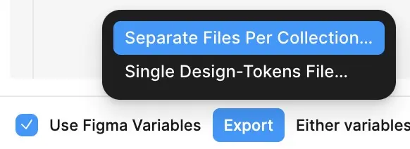

import { Tabs, TabItem } from '@astrojs/starlight/components';
import LangRefLink from '/src/components/LangRefLink.astro';

## Introduction
The "Figma to Slint" plugin bridges the gap between Figma designs and Slint user interfaces. It provides two primary functionalities:

1.  **Object Inspection:** Allows developers to select any object on the Figma canvas and view its properties (like dimensions, colors, fonts, etc.)formatted as a Slint code snippet. This is useful for quickly translating visual design elements into Slint code.  When paired with the variable export, this inserts variables into the code, if they are used in the figma file. 
2.  **Variable Export:** Enables the export of design tokens (variables for colors, numbers, strings, and booleans) defined in Figma directly into `.slint` files. This feature supports Figma's modes, allowing for themeable designs (e.g., light and dark modes) and generates the necessary Slint structs, enums, and global instances to use these tokens seamlessly in your Slint application.

## Setting up the Figma Inspector
First of all, find and enable the "Figma to Slint" plugin in the Figma Plugin Manager.
The inspector currently has 2 functions.  One is to inspect individual Figma objects for their properties, and the other is to export the variables defined in Figma so they are useable in Slint directly.

## Key Features of Variable Export

-   **Type Conversion:** 
    
    The plugin maps Figma variable types to their corresponding Slint types as follows:

    | Figma Variable Type | Slint Type |
    | ------------------- | ---------- |
    | Color               | `brush`    |
    | Float               | `length`   |
    | String              | `string`   |
    | Boolean             | `bool`     |

-   **Mode Support:** 
  For a figma file where Mode `MyCollection` has modes `light` and `dark`, the exporter will create a Slint `enum` for mode selection (e.g., `MyCollectionMode { light, dark }`).
  The file also contains a `Scheme` struct (`MyCollection-Scheme`) representing the structure of variables. A `Scheme-Mode` struct (`MyCollection-Scheme-Mode`) holds instances of the `Scheme` for each mode. And finally a global instance (`my_collection`) which contains:
        -   `mode`: An instance of `Scheme-Mode` holding the resolved values for each mode.
        -   `current-mode`: An `in-out` property using the mode `enum` to control the active mode.
        -   `current-scheme`: An `out` property dynamically selecting the correct scheme instance based on `current-mode`.
        -   `current`: An `out` property mirroring the `Scheme` structure, providing direct access to the values of the `current-scheme`.
-   **Alias Resolution:** Follows variable aliases (references) to find the underlying concrete value or target variable path.
-   **Hierarchy Generation:** Interprets `/` in Figma like  
    `colors/background/primary`
  to generate nested Slint structs so the corresponding variables are nested for dot notation in Slint, thus the above example turns into `colors.background.primary`
-   **Circular Reference Handling:** Detects dependency cycles between variables. If a cycle is detected within the same collection, it attempts to break the loop using the target's concrete value. Otherwise, or if the loop break fails, it resolves with a default value and logs a warning. Collections involved in cycles force a single-file export.
-   **Name Sanitization:** Cleans up collection, variable, and mode names to be valid Slint identifiers (e.g., converting spaces and special characters to underscores, handling leading digits).
-   **Export Options:**
    -   **Separate Files:** Exports each Figma collection into its own `.slint` file. Automatically generates necessary `import` statements between files if cross-collection references exist (unless a cycle forces single-file mode).
    -   **Single File:** Combines all collections into a single `design-tokens.slint` file. This is also the fallback if dependency cycles are detected.
-   **README Generation:** Creates a `README.md` file alongside the export, summarizing exported collections, renamed variables, detected circular references, and warnings.

## Usage

1.  **Inspector:**
    -   Bring up the plugin UI and select any object you'd like to inspect.
    
    
2.  **Variables:**
    -   To see and export variables, check the "Use Figma Variables" checkbox in the plugin UI.
    
    -   Now when selecting objects to inspect you should see variable names instead of resolved values (if they are assigned)
    
3.  **Export:** Click the "Export" button and choose:
    
    -   `Separate Files Per Collection…`: Recommended for organization if no recursive references exist. Creates `<collection_name>.slint` files.
    -   `Single Design-Tokens File…`: Creates `design-tokens.slint`. Necessary if any self references exist.
4.  **Integrate:**
    -   Place the generated `.slint` file(s) in your Slint project.


## Design-Token File Structure
      
1. **Import**
    ```slint
    // If separate files:
    import { Colors } from "colors.slint";
    import { Spacing } from "spacing.slint";
    ```
    ```slint
    // If single file:
    import { Colors, Spacing } from "design-tokens.slint";
    ```

2. **Use variables**
    ```slint
    // Use the tokens:
    MyComponent := Rectangle {
        background: Colors.current.background.primary; // Access via .current for mode switching
        height: Spacing.medium; // Access directly if single-mode or not mode-dependent
    }
    ```

3.  **Mode Switching:** (For multi-mode collections)
   Modify the `current-mode` property of the imported global:

    ```slint
    // Example: In your main component's logic
    init => {
        // Set initial mode
        Colors.current-mode = ColorsMode.dark;
    }
    // Or in response to a user action:
    clicked => {
        Colors.current-mode = (Colors.current-mode == ColorsMode.light) ? ColorsMode.dark : ColorsMode.light;
    }
    ```

    -   All properties accessed via `<collection_name>.current.*` will automatically update.

## Naming Conventions & Sanitization

-   **Hierarchy:** Figma uses `/` in variable names (e.g., `radius/small`, `font/body/weight`).  The export will use these to create nested Slint structs for code completion clarity.
-   **Sanitization:** Collection names, variable names (path segments), and mode names are automatically sanitized:
    -   Spaces and invalid characters (`&`, `+`, `:`, `-`, etc.) are typically converted to `-` for collection/struct names and `_` for property/enum names.
    -   Leading/trailing invalid characters are removed.
    -   Names starting with a digit are prefixed with `_` or `m_`.
    -   Any variable named exactly `mode` at the root of a collection is renamed to `mode-var` in the Slint output to avoid conflicts with the generated scheme `mode` property.

    #### Example
    Variable `Color & Shade (only #hex values)` in a collection named `Color Primitives` 
    would get turned into 
    `color-primitives.color_and_shade_only_hex_values`
