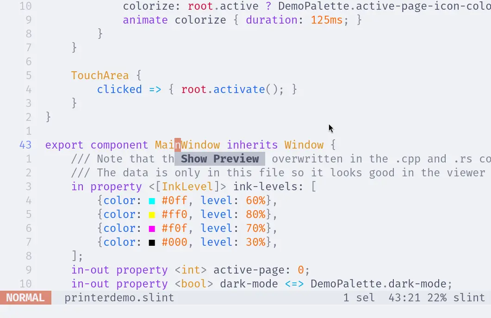

import Link from '@slint/common-files/src/components/Link.astro';

To install the Slint Language server, check the <Link type="SlintLSP" label="LSP Documentation"/>.

[Helix](https://helix-editor.com/) works out of the box without further configuration. To check if Helix detects Slint Language server successfully, run this command:

```sh
hx --health slint
```

The output should be like:

```
Configured language servers:
  ✓ slint-lsp: /home/user/.local/bin/slint-lsp
Configured debug adapter: None
Configured formatter: None
Highlight queries: ✓
Textobject queries: ✓
Indent queries: ✓
```

### Live Preview

To open the live preview, place the caret over a component name and trigger the code actions (bound to `<space>a` by default).
Depending on your configuration, this action might be bound to something else, so please check your configuration for the appropriate key binding (`code_action`).


