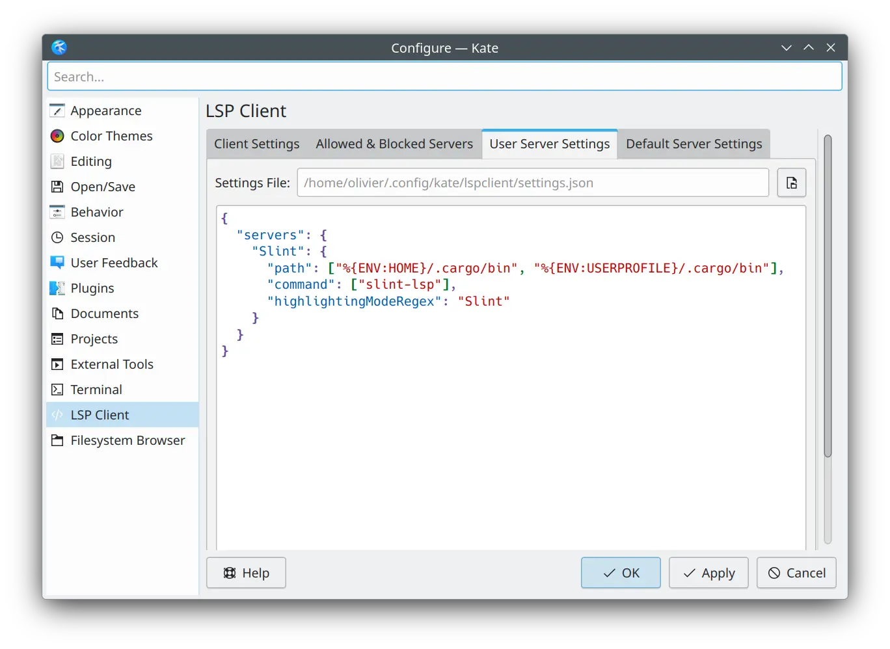

Before we start, it's important to note that Kate relies on the presence of syntax highlighting file for the usage of the LSP.
Therefore, we'll set up the syntax highlighting first.

### Syntax Highlighting

The file [slint.ksyntaxhighlighter.xml][syntax-xml] needs to be copied into a location where Kate can find it.
See the [kate documentation](https://docs.kde.org/stable5/en/kate/katepart/highlight.html#katehighlight-xml-format)

On Linux, this can be done by running this command

```sh
mkdir -p ~/.local/share/org.kde.syntax-highlighting/syntax/
wget https://raw.githubusercontent.com/slint-ui/slint/master/editors/kate/slint.ksyntaxhighlighter.xml -O ~/.local/share/org.kde.syntax-highlighting/syntax/slint.xml
```

On Windows, download [slint.ksyntaxhighlighter.xml][syntax-xml] into `%USERPROFILE%\AppData\Local\org.kde.syntax-highlighting\syntax`

### LSP

After setting up the syntax highlighting, you can now install the Slint Language server. Check the [LSP Documentation](../manual-setup/#slint-lsp) for instructions.

Once it is installed, go to *Settings > Configure Kate*. In the *Plugins* section, enable the *LSP-Client* plugin. This will add a *LSP Client* section in the settings dialog. In that *LSP Client* section, go to the *User Server Settings*, and  enter the following in the text area:

```json
{
  "servers": {
    "Slint": {
      "path": ["%{ENV:HOME}/.cargo/bin", "%{ENV:USERPROFILE}/.cargo/bin"],
      "command": ["slint-lsp"],
      "highlightingModeRegex": "Slint"
    }
  }
}
```



### Live Preview

Once the LSP is correctly set up, to preview a component, first, position your cursor on the name definition of the component you want to preview
(for instance, `MainWindow` in `component MainWindow inherits Window {`).
Then, activate the *Show Preview* code action.
You can do this by using the Alt+Enter shortcut to bring up the code action menu,
or find it in the menu bar at *LSP Client > Code Action > Show Preview*

[syntax-xml]: <https://github.com/slint-ui/slint/blob/master/editors/kate/slint.ksyntaxhighlighter.xml>
