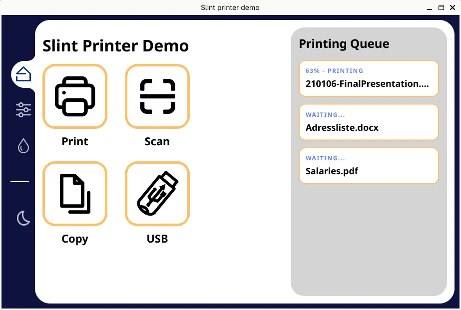

import Link from '@slint/common-files/src/components/Link.astro';

We provide extensions or configuration files for different editors to better support .slint files.

### Editors

- [Visual Studio Code](../vscode/)
- [Kate](../kate/)
- [Qt Creator](../qt-creator/)
- [Helix](../helix/)
- [(Neo-)Vim](../neo-vim/)
- [Sublime Text](../sublime-text/)
- [JetBrains IDE](../jetbrains/)
- [Zed](../zed)

If your favorite editor is not in the list of supported editors, it just means we did not test it, not that it doesn't work. We do provide a language server for Slint that should work with most editor that supports the Language Server Protocol (LSP). If you do test your editor with it, we would be happy to accept a pull request that adds instructions here.

## <a name="slint-lsp"/>Slint Language Server (`slint-lsp`)

Most modern editors use the [Language Server Protocol (LSP)](https://microsoft.github.io/language-server-protocol/) to add support for different programming languages.
Slint provides an LSP implementation with the `slint-lsp` binary.

### Installation

If you have Rust installed, you can install the binary by running the following command:

```sh
cargo install slint-lsp
```

This makes the latest released version available in `$HOME/.cargo/bin`. If you would like to try a development version, you can also point `cargo install` to the git repository:
for the released version. Or, to install the development version:

```sh
cargo install slint-lsp --git https://github.com/slint-ui/slint --force
```


Alternatively, you can download one of our pre-built binaries for Linux or Windows:

1. Go to [the latest Slint release](https://github.com/slint-ui/slint/releases/latest)
2. From "Assets" download either `slint-lsp-linux.tar.gz` for a Linux x86-64 binary
   or `slint-lsp-windows-x86_64.zip` for a Windows x86-64 binary.
3. Uncompress the downloaded archive into a location of your choice.

Make sure the required dependencies are found. On Debian-like systems install them with the following command:

```shell
sudo apt install -y build-essential libx11-xcb1 libx11-dev libxcb1-dev libxkbcommon0 libinput10 libinput-dev libgbm1 libgbm-dev
```

### Editor configuration

Once you have `slint-lsp` installed, configure your editor to use the binary, no arguments are required.
See our [list of editor configurations](#editors) for details.
If your editor is not on this list, please refer to your editors documentation for details on how to set up language servers.

### <a name="fmt"/>Formatting Slint files

Slint files can be auto-formatted with `slint-lsp` in the following ways:

- `slint-lsp format <path>` - reads the file and outputs the formatted version to stdout
- `slint-lsp format -i <path>` - reads the file and saves the output to the same file
- `slint-lsp format /dev/stdin` - using /dev/stdin you can achieve the special behavior
  of reading from stdin and writing to stdout

Note that `.slint` files are formatted, while `.md` and `.rs` files are searched for `.slint` blocks.
All other files are left untouched.

If you have `slint-lsp` configured in your editor, you should be able to format .slint files via your editor as well.

### Slint Live Preview

Slint's live preview feature lets you see your code changes in real-time.
This is a really powerful way to iterate quickly on your UI without having to recompile anything.

If you have slint-lsp configured in your editor, you can launch the live preview directly from your editor.

**Example in Neovim:**


### Running `slint-viewer` directly

To open the live preview from a terminal, you can use the `slint-viewer` binary.

To install it either:

* [Download the binary](https://github.com/slint-ui/slint/releases/latest)
* Run `cargo install slint-viewer` if you have a Rust installation

Then run `slint-viewer --auto-reload <path/to/file.slint>`.

**Example on the [Printer Demo](https://github.com/slint-ui/slint/blob/master/demos/printerdemo/ui/printerdemo.slint)**



## Additional resources

* [Slint Plugin for (Neo)vim](https://github.com/slint-ui/vim-slint)
* [Slint TreeSitter Grammar](https://github.com/slint-ui/tree-sitter-slint)
