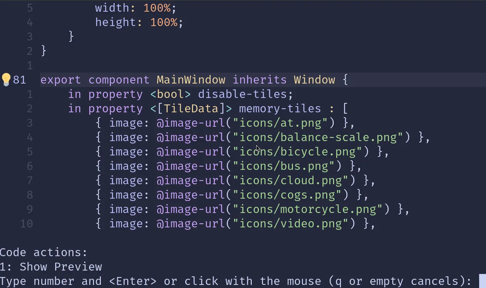
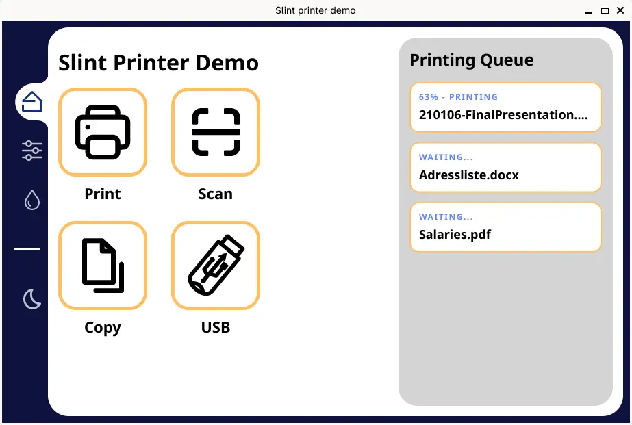

import Link from '@slint/common-files/src/components/Link.astro';

We provide extensions or configuration files for different editors to better support .slint files.

### Editors

- <Link type="VSCode" label="Visual Studio Code"/>
- <Link type="Kate" label="Kate"/>
- <Link type="QtCreator" label="Qt Creator"/>
- <Link type="Helix" label="Helix"/>
- <Link type="NeoVim" label="(Neo-)Vim"/>
- <Link type="SublimeText" label="Sublime Text"/>
- <Link type="JetBrains" label="JetBrains IDE"/>
- <Link type="Zed" label="Zed"/>

If your favorite editor is not in the list of supported editors, it just means we did not test it, not that it doesn't work. We do provide a language server for Slint that should work with most editor that supports the Language Server Protocol (LSP). If you do test your editor with it, we would be happy to accept a pull request that adds instructions here.

## <a name="slint-lsp"/>Slint Language Server (`slint-lsp`)

Most modern editors use the [Language Server Protocol (LSP)](https://microsoft.github.io/language-server-protocol/) to add support for different programming languages.
Slint provides an LSP implementation with the `slint-lsp` binary.

### Installation

There are multiple ways to install `slint-lsp`:

#### From pre-built binaries (with `cargo binstall`):

The fastest way to install `slint-lsp` is with [cargo binstall](https://github.com/cargo-bins/cargo-binstall), which automatically downloads and installs the pre-built binary:

```sh
cargo binstall slint-lsp
```

#### From source:

If you have a Rust toolchain installed, use `cargo install`:

```sh
cargo install slint-lsp
```

To install the development version from the git repository:

```sh
cargo install slint-lsp --git https://github.com/slint-ui/slint --force
```

Make sure the required dependencies are found. On Debian-like systems install them with the following command:

```shell
sudo apt install -y build-essential libx11-xcb1 libx11-dev libxcb1-dev libxkbcommon0 libinput10 libinput-dev libgbm1 libgbm-dev
```

#### From pre-built binaries (manual download):

You can also download the pre-built binaries from the Slint GitHub releases page:

1. Go to [the latest Slint release](https://github.com/slint-ui/slint/releases/latest)
2. From "Assets" download the appropriate `slint-lsp-*` archive for your architecture, for example:
    - Linux x86-64: [`slint-lsp-x86_64-unknown-linux-gnu.tar.gz`](https://github.com/slint-ui/slint/releases/latest/download/slint-lsp-x86_64-unknown-linux-gnu.tar.gz).
    - Windows x86-64: [`slint-lsp-x86_64-pc-windows-msvc.zip`](https://github.com/slint-ui/slint/releases/latest/download/slint-lsp-x86_64-pc-windows-msvc.zip).
    - Mac (Intel & Apple Silicon) [`slint-lsp-universal-apple-darwin.tar.gz`](https://github.com/slint-ui/slint/releases/latest/download/slint-lsp-universal-apple-darwin.tar.gz).
    - ARM binaries are also available for Linux and Windows (named aarch64 or armv7 respectively).
3. Uncompress the downloaded archive into a location of your choice (preferably somewhere in your PATH, so that it becomes available in your command line).

### Editor configuration

Once you have `slint-lsp` installed, configure your editor to use the binary, no arguments are required.
See our [list of editor configurations](#editors) for details.
If your editor is not on this list, please refer to your editors documentation for details on how to set up language servers.

### <a name="fmt"/>Formatting Slint files

Slint files can be auto-formatted with `slint-lsp` in the following ways:

- `slint-lsp format <path>` - reads the file and outputs the formatted version to stdout
- `slint-lsp format -i <path>` - reads the file and saves the output to the same file
- `slint-lsp format /dev/stdin` - using /dev/stdin you can achieve the special behavior
  of reading from stdin and writing to stdout

Note that `.slint` files are formatted, while `.md` and `.rs` files are searched for `.slint` blocks.
All other files are left untouched.

If you have `slint-lsp` configured in your editor, you should be able to format .slint files via your editor as well.

## Slint Live Preview (`slint-viewer`)

Slint's live preview feature lets you see your code changes in real-time.
This is a really powerful way to iterate quickly on your UI without having to recompile anything.

If you have slint-lsp configured in your editor, you can launch the live preview directly from your editor.

**Example in Neovim:**



### Running `slint-viewer` from the terminal

To open the live preview from a terminal, run `slint-viewer --auto-reload <path/to/file.slint>`.
See the <Link type="SlintViewer" label="Slint Viewer"/> page for installation, screenshots, and all command-line options.

**Example on the [Printer Demo](https://github.com/slint-ui/slint/blob/master/demos/printerdemo/ui/printerdemo.slint)**



## Additional resources

* [Slint Plugin for (Neo)vim](https://github.com/slint-ui/vim-slint)
* [Slint TreeSitter Grammar](https://github.com/slint-ui/tree-sitter-slint)
* [Editor Configuration Source](https://github.com/slint-ui/slint/tree/master/editors)
