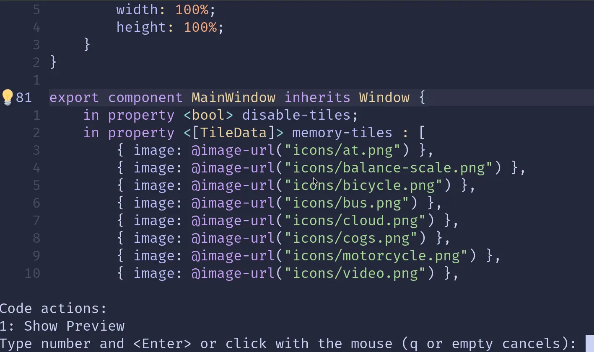

import Link from '@slint/common-files/src/components/Link.astro';

## Vim

To install the Slint Language server, check the <Link type="SlintLSP" label="LSP Documentation"/>.

Vim support the Language Server Protocol via its [Conquer of Completion](https://github.com/neoclide/coc.nvim)
plugin. Together with the Slint LSP server, this enables inline diagnostics and code completion when
editing `.slint` files.

After installing the extension, for example via [vim-plug](https://github.com/junegunn/vim-plug),
two additional configuration changes are needed to integrate the LSP server with vim:

1. Make vim recognize the `.slint` files with the correct file type

Install the [`slint-ui/vim-slint`](https://github.com/slint-ui/vim-slint) plugin.

Alternatively you can add the following to your vim configuration file (e.g. `vimrc`) to
enable automatic recognition of `.slint` files:

```
autocmd BufEnter *.slint :setlocal filetype=slint
```

2. Make sure the slint language server is installed and can be found in PATH.

3. Configure Conquer of Completion to use the Slint LSP server

Start `vim` and run the `:CocConfig` command to bring up the buffer that allows editing
the JSON configuration file (`coc-settings.json`), and make sure the following mapping
exists under the `language` server section:

```json
{
  "languageserver": {
    "slint": {
      "command": "slint-lsp",
      "filetypes": ["slint"]
    }
  }
}
```

## Neovim

Follow step 1. of the Vim section to get support for `.slint` files.

The easiest way to use the language server in Neovim is via the [`neovim/nvim-lspconfig`](https://github.com/neovim/nvim-lspconfig) plugin.

To install the language server you can:

- <Link type="SlintLSP" label="install and configure manually"/>
- install [Mason](https://github.com/mason-org/mason.nvim) and run `:MasonInstall slint-lsp` (on Windows, Linux and macOS)

### Live Preview

Once the `slint-lsp` language server is installed and running, you can open the live preview
by placing the caret over a component name and triggering the code actions (bound to `gra` by default).
Depending on your configuration, this action might be bound to something else, so please check your configuration for the appropriate key binding (`vim.lsp.buf.code_action()`).

You may also want to install a plugin that indicates when code actions are avilable like [kosayoda/nvim-lightbulb](https://github.com/kosayoda/nvim-lightbulb).

**Example with nvim-lightbulb**:



### Tree-sitter

If you use `nvim-treesitter` you can install the Tree Sitter parser for Slint using `TSInstall slint`
for syntax highlighting and indentation support.
