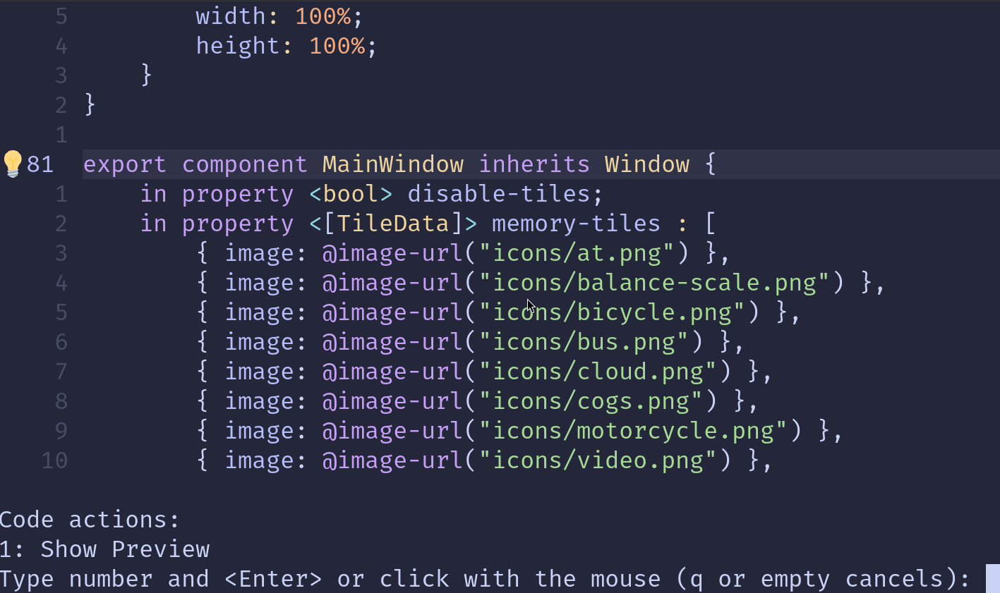
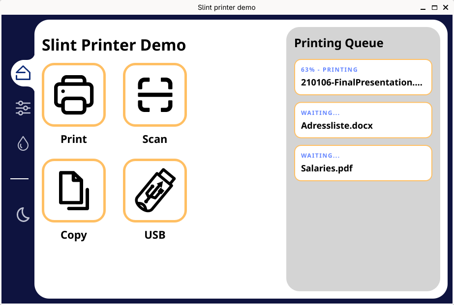

import Link from '@slint/common-files/src/components/Link.astro';

The easiest way to get started with Slint is to use <Link type="VSCode" label="Visual Studio Code with the Slint extension"/>.

[Helix](https://helix-editor.com/) should also work well out of the box.

Slint supports any other editors via the Language Server Protocol.

## Slint Language Server (`slint-lsp`)

Most modern editors use the [Language Server Protocol (LSP)](https://microsoft.github.io/language-server-protocol/) to add support for different programming languages.
Slint provides an LSP implementation with the `slint-lsp` binary.

To install `slint-lsp`, either:

* [Download the binary](https://github.com/slint-ui/slint/releases/latest)
* Run `cargo install slint-lsp` if you have a Rust installation

Please refer to your editors documentation for details on how to set up language servers.

### Formatting Slint files

Slint files can be auto-formatted using `slint-lsp format <file-name>`.

By default, this will print the formatted file to the terminal.
Use `-i`/`--inline` to format the file on disk.

If you have slint-lsp configured in your editor, you should be able to format .slint files via your editor as well.

### Slint Live Preview

Slint's live preview feature lets you see your code changes in real-time.
This is a really powerful way to iterate quickly on your UI without having to recompile anything.

If you have slint-lsp configured in your editor, you can launch the live preview directly from your editor.

**Example in Neovim:**

### Running `slint-viewer` directly

To open the live preview from a terminal, you can use the `slint-viewer` binary.

To install it either:

* [Download the binary](https://github.com/slint-ui/slint/releases/latest)
* Run `cargo install slint-viewer` if you have a Rust installation

Then simply run `slint-viewer --auto-reload <path/to/file.slint>`.

**Example on the [Printer Demo](https://github.com/slint-ui/slint/blob/master/demos/printerdemo/ui/printerdemo.slint)**

## Additional resources

* [Slint Plugin for (Neo)vim](https://github.com/slint-ui/vim-slint)
* [Slint TreeSitter Grammar](https://github.com/slint-ui/tree-sitter-slint)
