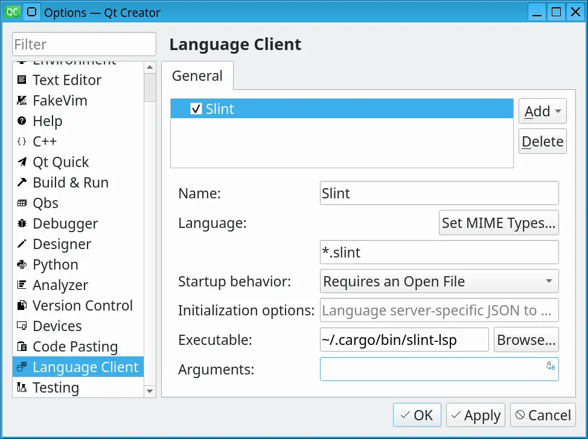

import Link from '@slint/common-files/src/components/Link.astro';

### Syntax Highlighting

For the **syntax highlighting**, QtCreator supports the same format as Kate, with
the [xml file][syntax-xml] at the same location.
Refer to the instruction from the <Link type="KateSyntaxHighlighting" label="Kate page"/> to enable syntax highlighting.

### LSP

To install the Slint Language server, check the <Link type="SlintLSP" label="LSP Documentation"/>.

To setup the lsp:

 1. Install the `slint-lsp` binary
 2. Then in Qt creator, go to *Tools > Option* and select the *Language Client* section.
 3. Click *Add*
 4. As a name, use "Slint"
 5. use `*.slint` as a file pattern. (don't use MIME types)
 6. As executable, select the `slint-lsp` binary (no arguments required)
 7. Click *Apply* or *Ok*

### Live Preview

Once you have set up the LSP, in order to **preview a component**, when you have a .slint file open, place your cursor to
the name of the component you would like to preview and press *Alt + Enter* to open
the code action menu. Select *Show Preview* from that menu.

[syntax-xml]: <https://github.com/slint-ui/slint/blob/master/editors/kate/slint.ksyntaxhighlighter.xml>
