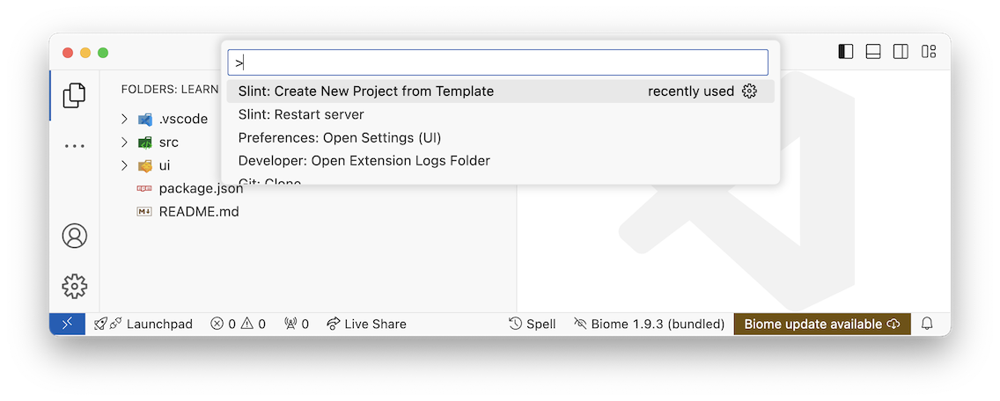
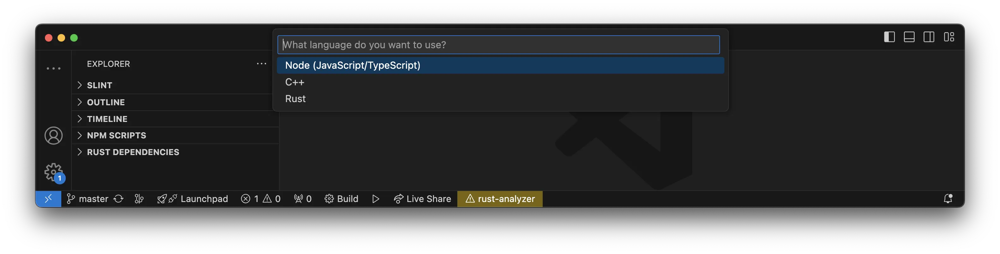
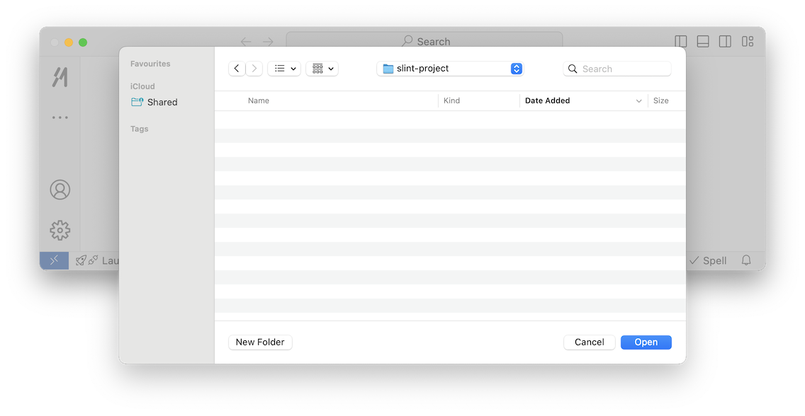

{/* cSpell: ignore Wwctiow */}

import { Steps, Tabs, TabItem } from '@astrojs/starlight/components';
import { YouTube } from 'astro-embed';
import Link from '@slint/common-files/src/components/Link.astro';

<YouTube id="fWwctiowLnY" poster="https://github.com/user-attachments/assets/873f51b3-cb32-44f7-be8b-6e4c03c204ff" />

The Slint extension for Visual Studio Code (VS Code) gives you syntax highlighting, completion, diagnostics,
a live preview of the UI, and a command to create a new project from a template.
This page shows how to install it and create a project from a template.

:::note[Note]
We support many other tools and editors, see <Link type="ManualEditorSetup" label="here"/>.
:::

## Setting Up VS Code

<Steps>

1. **Install VS Code.**
Download it [here](https://code.visualstudio.com).

2. **Install the Slint extension.**
Find it [here](https://marketplace.visualstudio.com/items?itemName=Slint.slint).

3. **Create a new project based on a Slint template.**
This is done via the command palette (CTRL+Shift+P) or on MacOS (CMD+Shift+P).

Start typing 'slint' and from the options select 'Slint: Create New Project from Template'.
4. **Choose your language.**

Then select from the list of languages.

5. **Choose a folder to save the project in.**

6. **Name the project.**
Give the project a name and now a new project will be created in the selected folder based
on a simple template to get you started.

</Steps>

