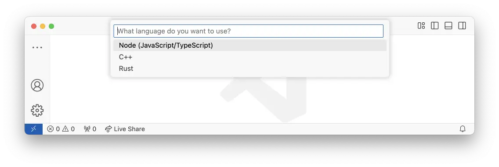

import { Steps, Tabs, TabItem } from '@astrojs/starlight/components';
import { YouTube } from 'astro-embed';

<YouTube id="fWwctiowLnY" poster="https://github.com/user-attachments/assets/873f51b3-cb32-44f7-be8b-6e4c03c204ff" />

If you are new to Slint and want to quickly get started and learn the basics, we recommend
using Visual Studio Code (VS Code). VS Code is popular, free and thanks to the Slint extension
it's also the easiest to get started with.

:::note[Note]
We support many other tools and editors, see [here](https://github.com/slint-ui/slint/blob/master/editors/README.md#editors).
:::

## Setting Up VS Code

<Steps>

1. **Install VS Code.**
Download it [here](https://code.visualstudio.com).

2. **Install the Slint extension.**
Find it [here](https://marketplace.visualstudio.com/items?itemName=Slint.slint).

3. **Create a new project based on a Slint template.**
This is done via the command palette (CTRL+Shift+P) or on MacOS (CMD+Shift+P).

Start typing 'slint' and from the options select 'Slint: Create New Project from Template'.
4. **Choose your language.**

Then select from the list of languages.

5. **Choose a folder to save the project in.**

6. **Name the project.**
Give the project a name and now a new project will be created in the selected folder based
on a simple template to get you started.

</Steps>

