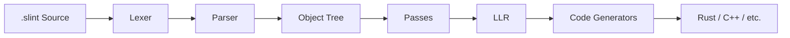
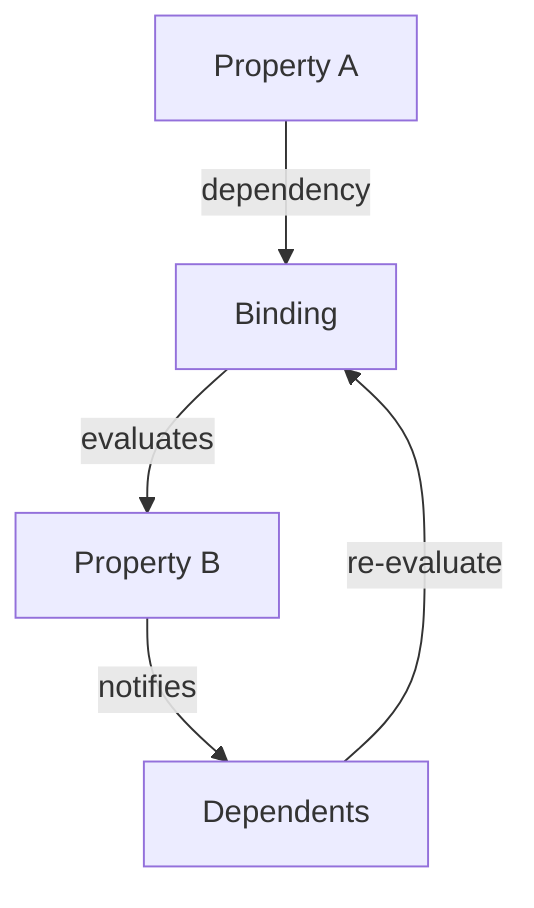

<!-- cSpell: ignore frontends -->
# Slint development guide

The build instructions are in the [building.md](./building.md) file.
The testing instructions are in the [testing.md](./testing.md) file.

## Environment Setup

[`mise-en-place`](https://mise.jdx.dev/) can be used to install the necessary
development tooling. After installing `mise` and registering `mise` with your
shell, go into your git checkout directory and `mise trust -a` the configuration
we ship. Afterwards `mise install` makes all the necessary tooling available.

Even if you do not want to use mise: `.mise/config.toml` contains a handy list of tools
to make available.

## Repository structures

### `helper_crates`

A set of crates that are somehow not strictly related to Slint, and that could be moved to
their own repository and have their own version release at some point.

### `internal`

`internal` contains code that isn't meant to be used directly by a user of Slint.

#### `compiler`

The main library for the compiler for .slint.

Nothing in there should depend on the runtime crates.

There is a **`test`** subdirectory that contains the syntax tests.
These tests allow you to test the proper error conditions.

#### Runtime libraries

The library crates that are used at runtime.

* **`core`** is the main library. It's meant to be used for all front-ends. Ideally it should
  be kept as small as possible. **`corelib-macros`** contains some procedural macro used by core library.
* **`backends`** contains the different backend for the different platform, separated from
  core library. Currently there is just the gl backend
* **`interpreter`** is the library used by the more dynamic languages backend to compile and
  interpret .slint files. It links both against core library and the compiler lib

### `tools`

* **`compiler`** is the tool to generate the target language (e.g. c++) from the .slint files for
  frontend that have a compilation step and generated code.
* **`viewer`** is a tool that allow to open and view a .slint file.

### `api`

Here one can find the frontends for different languages.

### `tests`

The integration test that are testing a bunch of .slint with different front-ends

See [testing.md](./testing.md)

### `examples`

Some manual tests

## Architecture Overview

This section provides a high-level overview of Slint's internal architecture for developers contributing to the project.

### Compiler Pipeline

The Slint compiler transforms `.slint` source files into target language code through these stages:



| Stage | Location | Description |
|-------|----------|-------------|
| **Lexer** | `internal/compiler/lexer.rs` | Tokenizes `.slint` source into tokens |
| **Parser** | `internal/compiler/parser.rs` | Builds syntax tree from tokens |
| **Object Tree** | `internal/compiler/object_tree.rs` | High-level IR representing components and elements |
| **Passes** | `internal/compiler/passes/` | ~50 transformation and optimization passes |
| **LLR** | `internal/compiler/llr/` | Low-Level Representation for code generation |
| **Generators** | `internal/compiler/generator/` | Target-specific code generators (Rust, C++, etc.) |

### Compiler Passes

Passes are organized into three phases in `internal/compiler/passes.rs`:

**1. Import Passes** (`run_import_passes`)
- `inject_debug_hooks` - Add debugging support
- `infer_aliases_types` - Resolve type aliases
- `resolving` - Resolve expressions, types, and references
- `purity_check` - Verify function purity
- `check_expressions` - Validate expression semantics

**2. Transformation Passes** (main `run_passes`)
- `lower_*` passes - Transform high-level constructs (states, layouts, popups, etc.)
- `inlining` - Inline components as needed
- `collect_*` passes - Gather globals, structs, subcomponents
- `focus_handling` - Set up focus navigation
- `default_geometry` - Calculate default sizes

**3. Optimization Passes**
- `const_propagation` - Propagate constant values
- `remove_aliases` - Eliminate property aliases
- `remove_unused_properties` - Dead code elimination
- `deduplicate_property_read` - Optimize property access
- `optimize_useless_rectangles` - Remove unnecessary elements

### Property Binding & Propagation

Slint's reactive property system is implemented in `internal/core/properties.rs`:



**Key concepts:**
- **Properties** (`Property<T>`) hold values and track dependencies
- **Bindings** are expressions that compute property values
- **Dependency tracking** uses a doubly-linked list (`DependencyListHead`/`DependencyNode`)
- When a property changes, all dependent bindings are marked dirty and re-evaluated

The binding evaluation is lazy - properties are only recomputed when read after being marked dirty.

### Backend Selection

The backend selector (`internal/backends/selector/`) chooses the platform abstraction at runtime.

**Environment Variable: `SLINT_BACKEND`**

| Value | Description |
|-------|-------------|
| `qt` | Qt backend (native look, requires Qt) |
| `winit` | Winit backend (cross-platform, default on most systems) |
| `winit-femtovg` | Winit with FemtoVG OpenGL renderer |
| `winit-skia` | Winit with Skia renderer |
| `winit-software` | Winit with software renderer |
| `linuxkms` | Direct Linux KMS/DRM (embedded systems) |
| `testing` | Testing backend (headless) |

**Default Priority** (when `SLINT_BACKEND` is not set):
1. **Qt** - if `i-slint-backend-qt` feature is enabled and Qt is available
2. **Winit** - if `i-slint-backend-winit` feature is enabled
3. **LinuxKMS** - on Linux with `i-slint-backend-linuxkms` feature

**Verifying the Active Backend:**
Currently, there's no built-in way to query which backend is active at runtime. Check the features enabled in your `Cargo.toml` and any `SLINT_BACKEND` environment variable.


## Documentation

There are some documentations comments in the code.
HTML documentation can be generated with something like

```sh
cargo doc --document-private-items --no-deps --open
```

## Rust to C++ bindings

We use a rather complex mechanism to expose internal data structures implemented in Rust to C++, in a way that allows us to provide a nice C++ API.

As a starting point, we recommend reading the blog entry we published about this:

[https://slint.dev/blog/expose-rust-library-to-other-languages.html](https://slint.dev/blog/expose-rust-library-to-other-languages.html)

What this article omits are how we invoke cbindgen and what kind of tweaks we apply on various levels:

The C++ library consists of four components:

1. The `slint-cpp` cdylib created by `cargo`/`rustc` from `api/cpp`.
2. The public header files in `api/cpp/include`.
3. Internal header files generated by `cbindgen`, via `cargo xtask cbindgen`.
4. The CMake project to tie it all together by invoking `corrosion` to call `cargo` and invoking `cbindgen`.

### `cbindgen`

The `cbindgen` xtask generates multiple header files for four different modules:

1. The types in the core library. This is the bulk of the generated code.
2. The entry points into the C++ library for creating backends, invoking the event loop, etc. - from `api/cpp/lib.rs`.
3. The types specific to the Qt backend used by the Qt style, such as `NativeButton`, etc.
4. The types used by the C++ interpreter API, written to `slint_interpreter_internal.h`.

Typically the input to `cbindgen` is within `ffi` sub-modules in the corresponding input crates to `cbindgen`. These `ffi` modules are gated with `#[cfg(feature = "ffi")]`.

## Commit History & Code Reviews

Linear history is preferred over merge commits. Long lived features can live in feature branches and those can be integrated
with merge commits, of course.

As a consequence, we typically integrate pull requests as "rebase and merge" or "squash and merge".

During code review, consider adding small commits on top to make it easier for the reviewer and contributor to track feedback and
how the feedback was incorporated - rebase can tend to make it harder. It's perfectly fine to then squash these commits when the
review phase is complete and approval is given.

Example:

A PR consists of three commits:

1. Add new widget
2. Add documentation for new widget
3. Change example to use new widget

In the review phase, the reviewer suggests to make changes to the widget implementation and the documentation. Consider pushing
these as follow-up fixes:

1. Add new widget
2. Add documentation for new widget
3. Change example to use new widget
4. Fix an issue in widget found during review
5. Fix a typo in the documentation

Finally, the PR is approved. As contributor, in your local branch, feel free to merge 4. into 1. and 5. into 2.:

(commits are real, sha1s are just examples)

As a first step, let's rebase our changes to make sure that there are no conflicts:

```bash
git rebase origin/master
```

This might run through without stopping. If there are merge conflicts to be resolved, `git rebase` will stop
and let you fix it. For instructions how to resolve the conflicts and continue, see [Resolving merge conflicts after a Git rebase](https://docs.github.com/en/get-started/using-git/resolving-merge-conflicts-after-a-git-rebase).

When your branch is rebased, proceed to squash the fixup commits. Start an interactive rebase that starts at the base commit:

```
$ git rebase -i origin/master
```

This launches the configured editor with the above list of commits,
in the order as they will committed:

```
pick 82916bc2 Add new widget
pick e55bde4c Add documentation for new widget
pick 9bc8d203 Change example to use new widget
pick a6feda52 Fix an issue in widget found during review
pick 032032dc Fix a typo in the documentation
```

Let's merge 4. into 1. and 5. into 2. by changing the above:

```
pick 82916bc2 Add new widget
fixup a6feda52 Fix an issue in widget found during review
pick e55bde4c Add documentation for new widget
fixup 032032dc Fix a typo in the documentation
pick 9bc8d203 Change example to use new widget
```

Save and exit the editor.

Now git will start at the base commit, cherry-pick the first commit, and squash the "Fix an issue in widget found during code review"
change into the same commit. Use `squash` instead of `fixup` if you want to also further edit the commit message.

Save and exit the editor.

Now git continues to do the same with the second squash. Do as in the previous step and adjust the commit message to suit the
original intent ("Add documentation for new widget").

Save and exit the editor. Rinse and repeat until the rebase is complete.

Use a tool like [GitHub Desktop](https://desktop.github.com) or [gitk](https://git-scm.com/docs/gitk) to take another look at the
git history of commits.

Are all the fix-up commits merged with the original changes? Do the commit messages look okay?

If you need further changes, run `$ git rebase -i origin/master` again.

When the history is clean, double check that you're going to push to the right branch:

```
$ git push --dry-run -f
```

If that looks okay and targets the right branch for your PR, push with force:

```
$ git push -f
```
