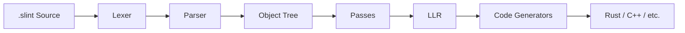
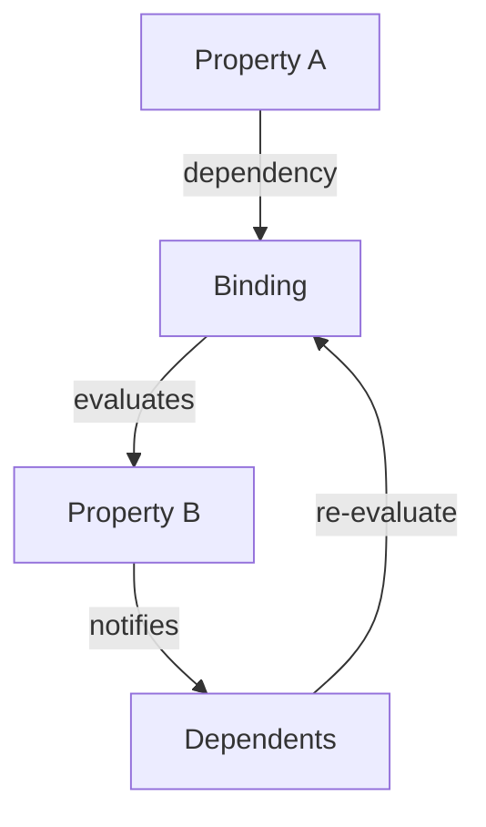

# Compiler & Runtime Internals

> **When to load this document:** Working on compiler passes, code generation,
> property bindings, the reactive system, or adding new language features.
> For general build commands and project structure, see `/AGENTS.md`.

## Compiler Pipeline

The Slint compiler transforms `.slint` source files into target language code through these stages:



| Stage | Location | Description |
|-------|----------|-------------|
| **Lexer** | `internal/compiler/lexer.rs` | Tokenizes `.slint` source into tokens |
| **Parser** | `internal/compiler/parser.rs` | Builds syntax tree from tokens |
| **Object Tree** | `internal/compiler/object_tree.rs` | High-level IR representing components and elements |
| **Passes** | `internal/compiler/passes/` | ~50 transformation and optimization passes |
| **LLR** | `internal/compiler/llr/` | Low-Level Representation for code generation |
| **Generators** | `internal/compiler/generator/` | Target-specific code generators (Rust, C++, etc.) |

## Compiler Passes

Passes are organized into three phases in `internal/compiler/passes.rs`:

### 1. Import Passes (`run_import_passes`)
- `inject_debug_hooks` - Add debugging support
- `infer_aliases_types` - Resolve type aliases
- `resolving` - Resolve expressions, types, and references
- `purity_check` - Verify function purity
- `check_expressions` - Validate expression semantics

### 2. Transformation Passes (main `run_passes`)
- `lower_*` passes - Transform high-level constructs (states, layouts, popups, etc.)
- `inlining` - Inline components as needed
- `collect_*` passes - Gather globals, structs, subcomponents
- `focus_handling` - Set up focus navigation
- `default_geometry` - Calculate default sizes

### 3. Optimization Passes
- `const_propagation` - Propagate constant values
- `remove_aliases` - Eliminate property aliases
- `remove_unused_properties` - Dead code elimination
- `deduplicate_property_read` - Optimize property access
- `optimize_useless_rectangles` - Remove unnecessary elements

## Property Binding & Reactivity

Slint's reactive property system is implemented in `internal/core/properties.rs`:



**Key concepts:**
- **Properties** (`Property<T>`) hold values and track dependencies
- **Bindings** are expressions that compute property values
- **Dependency tracking** uses a doubly-linked list (`DependencyListHead`/`DependencyNode`)
- When a property changes, all dependent bindings are marked dirty and re-evaluated

The binding evaluation is lazy - properties are only recomputed when read after being marked dirty.

## Interpreter vs Compiled Modes

Slint supports two execution modes with different code paths:

| Mode | Entry Point | Use Case |
|------|-------------|----------|
| **Compiled** | `slint!` macro, `slint-build` | Production apps, maximum performance |
| **Interpreted** | `slint-interpreter` crate | Runtime `.slint` loading, tooling, scripting |

The interpreter (`internal/interpreter/`) compiles `.slint` at runtime and uses dynamic dispatch, while the compiled path generates static Rust/C++ code at build time.

## Key Data Structures

| Structure | Location | Purpose |
|-----------|----------|---------|
| `Document` | `compiler/object_tree.rs` | Root of parsed `.slint` file |
| `Component` | `compiler/object_tree.rs` | A component definition |
| `Element` | `compiler/object_tree.rs` | An element within a component |
| `Expression` | `compiler/expression_tree.rs` | Compiled expressions |
| `Type` | `compiler/langtype.rs` | Type system representation |
| `CompilationUnit` | `compiler/llr/mod.rs` | LLR output ready for code generation |

## Common Modification Patterns

### Adding a New Built-in Element

1. **Define the element** in `internal/compiler/builtins.slint`
2. **Add runtime item** in `internal/core/items/` (new file or existing)
3. **Register the item** in `internal/core/items.rs` (add to `ItemVTable`)
4. **Update type registry** in `internal/compiler/typeregister.rs`
5. **Add rendering support** in each renderer (`internal/renderers/*/`)
6. **Add tests** in `tests/cases/elements/`

### Adding a New Compiler Pass

1. **Create pass file** in `internal/compiler/passes/your_pass.rs`
2. **Add to mod.rs** in `internal/compiler/passes/mod.rs`
3. **Register in pipeline** in `internal/compiler/passes.rs` (choose appropriate phase)
4. **Add tests** - either unit tests in the pass file or `.slint` test cases

### Adding a New Property Type

1. **Define type** in `internal/compiler/langtype.rs`
2. **Add parsing support** if new syntax needed
3. **Handle in relevant passes** (type checking, lowering)
4. **Add runtime support** in `internal/core/` if needed
5. **Update code generators** in `internal/compiler/generator/`

## Debugging Tips

### Inspecting Generated Code

To see the Rust code that the compiler generates from a `.slint` file:

```sh
cargo run -p slint-compiler -- -f rust path/to/file.slint | rustfmt > path/to/file.slint.rs
```

To see the generated C++ code:
```sh
cargo run -p slint-compiler -- -f cpp path/to/file.slint > path/to/file.slint.cpp
```

This is invaluable when debugging code generation issues — you can see exactly what the generators emit without running a full build of an application.
