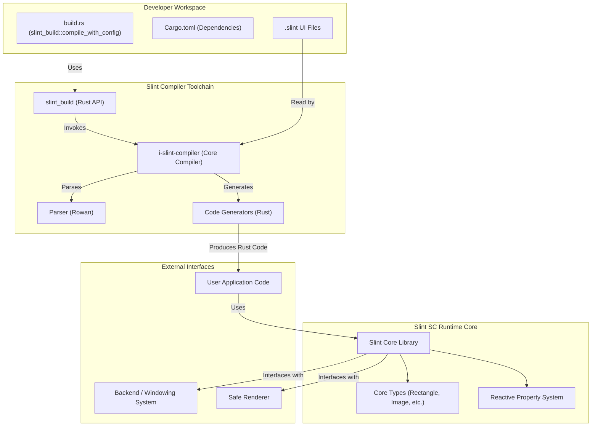
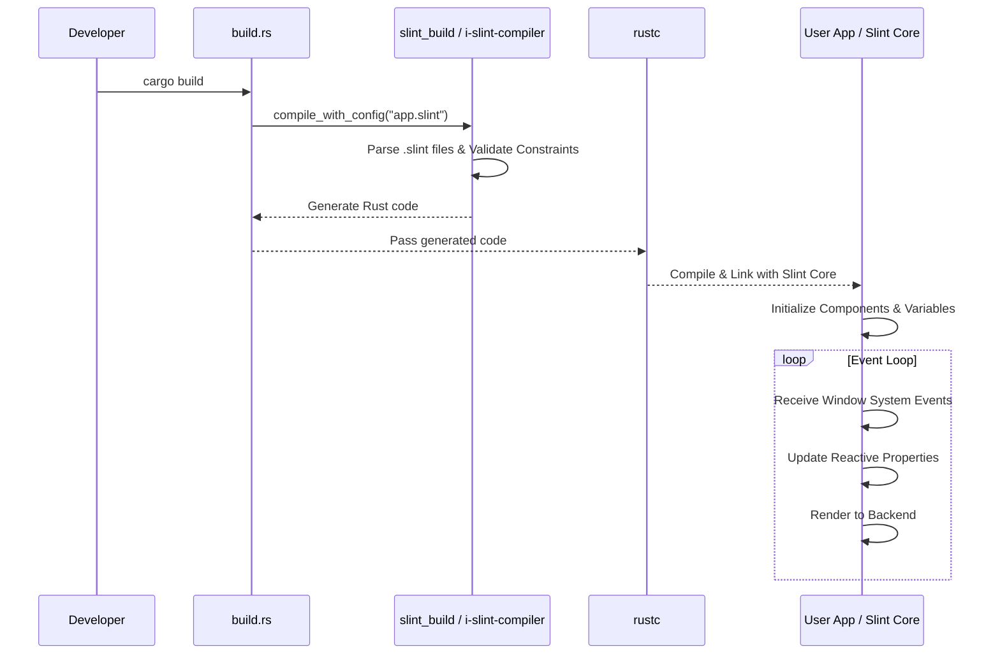

## Slint SC Software Units (ISO 26262:6 7.4.4)

This is what is included in Slint SC:

* A Slint Compiler, from the internal `i-slint-compiler` crate
* The `slint_build` crate which provides a Rust API for the compiler.
* Slint types: Currently we support `Rectangle` and `Image`, with basic properties.
* (TODO: Add list of Rust crates used by Slint SC)

Each of these things can have a **Usage** and a **Constraints** section.

Each feature of the language or a library can map to a Requirement ID, and have 1 or more code test-examples.

## Slint SC Architecture Design (ISO 26262:6 7.4)

During the development of the software architectural design, the following should be considered:

1. Verifiability of the software architectural design.
    This implies bi-directional traceability between the software architectural design and the
    software safety requirements.
2. Simplicity of the design/software (restricted size and complexity)
3. Modularity, Encapsulation, Reusability, Maintainability
4. Feasibility for the design and implementation of the software units
5. Testability of the software
6. Maintainability of the software architectural design

### Static Design

The software architectural design should have a static design part which
addresses:

- the software structure including its hierarchical levels;
- the dependencies;
- the data types and their characteristics;
- the global variables;
- the external interfaces of the software components; and
- the constraints including the scope of the architecture

### Dynamic Design

In addition, the software architectural design should have a dynamic design part which addresses:

- the functional chain of events and behavior;
- the logical sequence of data processing;
- the control flow and concurrency of processes;
- the data flow through interfaces and global variables; and
- the temporal constraints.

