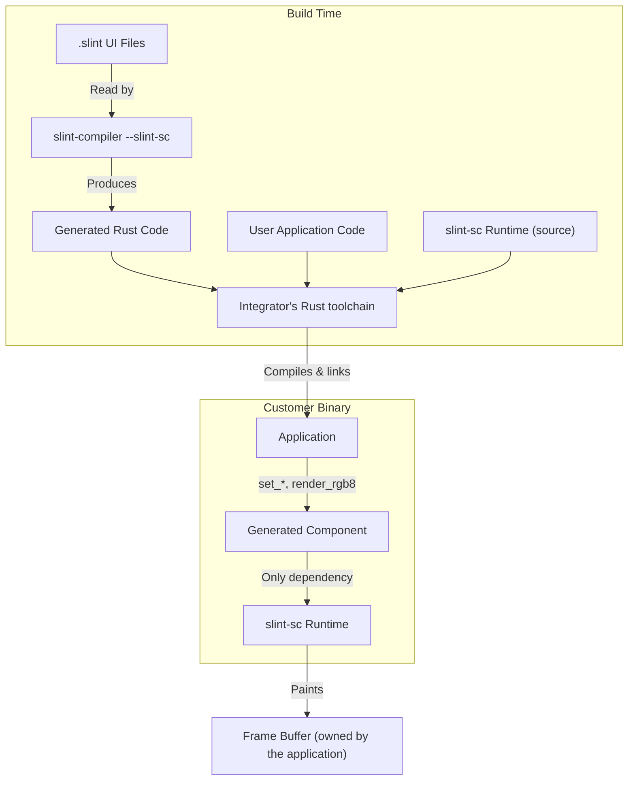
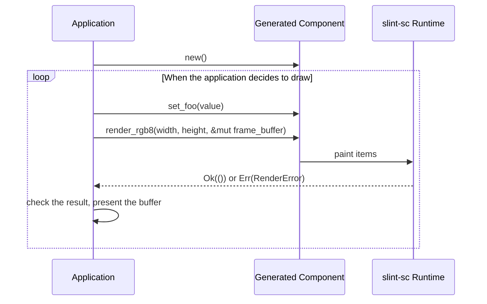

## Slint SC Software Units (ISO 26262:6 7.4.4)

Slint SC consists of three units.

* **The Slint compiler**, the `slint-compiler` binary from `tools/compiler`, built with the `slint-sc` feature and invoked with `--slint-sc`.
  It translates a `.slint` file into Rust code, and rejects everything outside the qualified subset.
  It's a tool: it runs at build time and doesn't ship in the product.
* **The `slint-sc` runtime crate**, from `api/slint-sc`.
  It ships in the customer's binary.
  It's `no_std`, uses no `alloc`, and depends on no other crate.
* **The generated code**, produced by the compiler from the customer's `.slint` files.
  Its only dependency is the `slint-sc` runtime crate; see [`sls.gen.output`](/reference/generated-code/#sls.gen.output).

The qualified subset currently contains the `Rectangle`, `Window`, and `TouchArea` elements, with basic properties.
The [API Reference](/reference/) is generated from the `\sc` markers in the compiler's builtins, so it lists exactly what the subset contains.

(TODO: `slint_build` doesn't support Slint SC yet, so there's no build-script
integration; the compiler binary is invoked directly. Decide whether
`slint_build` gains a safety-critical mode or the manual documents the direct
invocation.)

## Slint SC Architecture Design (ISO 26262:6 7.4)

During the development of the software architectural design, the following should be considered:

1. Verifiability of the software architectural design.
    This implies bi-directional traceability between the software architectural design and the
    software safety requirements.
2. Simplicity of the design/software (restricted size and complexity)
3. Modularity, Encapsulation, Reusability, Maintainability
4. Feasibility for the design and implementation of the software units
5. Testability of the software
6. Maintainability of the software architectural design

### Properties

Two properties of the design hold by construction, so nothing has to be done to maintain them and no constraint on the integrator depends on them.

* The architecture separates business logic, which the application owns, from presentation logic, which Slint SC owns.
  Slint SC renders; it doesn't hold application state.
* The runtime is `no_std`, doesn't use `alloc`, and has no dependencies, so there's no allocator and no dynamic memory allocation.
  The application owns the frame buffer and passes it to `render_rgb8`.
* Slint SC's responsibility ends at the frame buffer.
  Getting the buffer onto a display, through a display controller, a driver, or another crate, is the application's job, and no part of Slint SC takes part in it.

### Static Design

The software architectural design should have a static design part which
addresses:

- the software structure including its hierarchical levels;
- the dependencies;
- the data types and their characteristics;
- the global variables;
- the external interfaces of the software components; and
- the constraints including the scope of the architecture

The whole binary, the runtime included, is compiled by the integrator's Rust toolchain: the `slint-sc` crate ships as source.
Our own builds and test evidence use Ferrocene; the toolchain of the final build is the integrator's choice, and choosing a qualified one is on them.

### Dynamic Design

In addition, the software architectural design should have a dynamic design part which addresses:

- the functional chain of events and behavior;
- the logical sequence of data processing;
- the control flow and concurrency of processes;
- the data flow through interfaces and global variables; and
- the temporal constraints.

There is no event loop and no thread inside Slint SC.
The application decides when a frame is drawn, and every call runs synchronously on the caller's thread.

