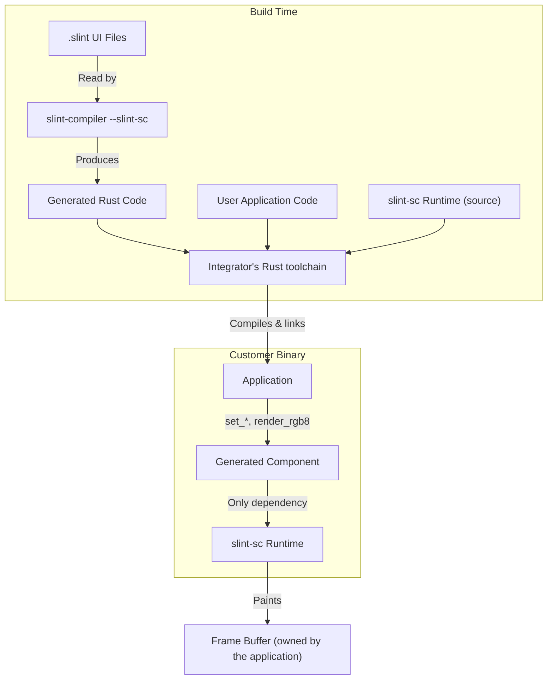
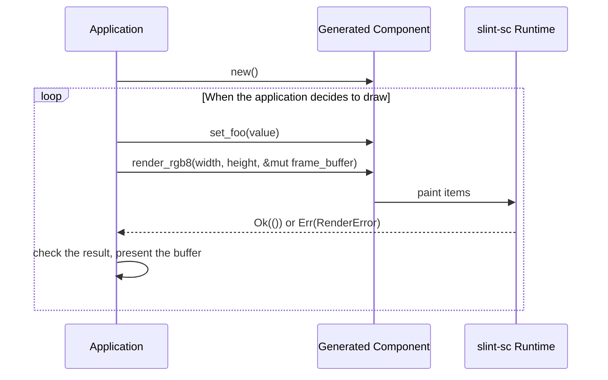

This chapter describes the units that make up Slint SC, and how they fit together at build time and at run time.

## Software Units

**Addresses:** ISO 26262-6 7.4.4

Slint SC consists of three units.

* **The Slint compiler**, the `slint-compiler` binary from `tools/compiler`, built with the `slint-sc` feature and invoked with `--slint-sc`.
  The compiler translates a `.slint` file into Rust code, and rejects everything outside the qualified subset.
  The compiler is a tool: it runs at build time and doesn't ship in the product.
* **The `slint-sc` runtime crate**, from `api/slint-sc`.
  The runtime crate ships in the customer's binary.
* **The generated code**, produced by the compiler from the customer's `.slint` files.
  Its only dependency is the `slint-sc` runtime crate; see [`sls.gen.output`](/reference/generated-code/#sls.gen.output).

The [Reference](/reference/) lists the elements and properties of the qualified subset.
The Reference is generated from the `\sc` markers in the compiler's builtins, so the Reference lists exactly what the subset contains.

## Architectural Design

**Addresses:** ISO 26262-6 7.4

During the development of the software architectural design, 7.4.2 says the following shall be considered:

1. Verifiability of the software architectural design.
    This implies bi-directional traceability between the software architectural design and the
    software safety requirements.
2. Suitability for configurable software.
3. Feasibility for the design and implementation of the software units.
4. Testability of the software architecture during software integration testing.
5. Maintainability of the software architectural design.

7.4.1 and 7.4.3 add the characteristics the design itself has to show: comprehensibility, consistency, simplicity, verifiability, modularity, abstraction, encapsulation, and maintainability.

### Properties

Three properties of the design hold by construction.
Nobody has to do anything to maintain these properties, and no constraint on the integrator depends on them.

* The architecture separates business logic, which the application owns, from presentation logic, which Slint SC owns.
  Slint SC renders, and doesn't hold application state.
* The runtime is `no_std`, doesn't use `alloc`, and has no dependencies, so there's no allocator and no dynamic memory allocation.
  The application owns the frame buffer and passes it to `render_rgb8`.
* Slint SC's responsibility ends at the frame buffer.
  Getting the buffer onto a display is the application's job, whether through a display controller, a driver, or another crate.
  No part of Slint SC takes part in presenting the buffer.

### Dependencies

Because the runtime has no dependencies (see [Properties](#properties)), nothing below the runtime needs qualifying, and the runtime inherits no other code's failures.

The compiler uses external crates, but none of its code ships in the product.
The compiler's [tool qualification](/evaluation-report/) covers the compiler's dependencies.

A dependency added to the runtime would be software developed outside this process.
Such a dependency would need its own evidence under ISO 26262-8 Clause 12 before the runtime could use it.

### Static Design

7.4.5 says the software architectural design shall describe its static design aspects, which address:

- the software structure including its hierarchical levels;
- the data types and their characteristics;
- the external interfaces of the software components;
- the external interfaces of the embedded software;
- the global variables; and
- the constraints including the scope of the architecture and external dependencies.

The integrator's Rust toolchain compiles the whole binary, the runtime included, because the `slint-sc` crate ships as source.
Our own builds and test evidence use Ferrocene.
The integrator chooses the toolchain of the final build, and is responsible for choosing a qualified one.

### Dynamic Design

7.4.5 also says the software architectural design shall describe its dynamic design aspects, which address:

- the functional chain of events and behavior;
- the logical sequence of data processing;
- the control flow and concurrency of processes;
- the data flow through interfaces and global variables; and
- the temporal constraints.

There is no event loop and no thread inside Slint SC.
The application decides when a frame is drawn, and every call runs synchronously on the caller's thread.

