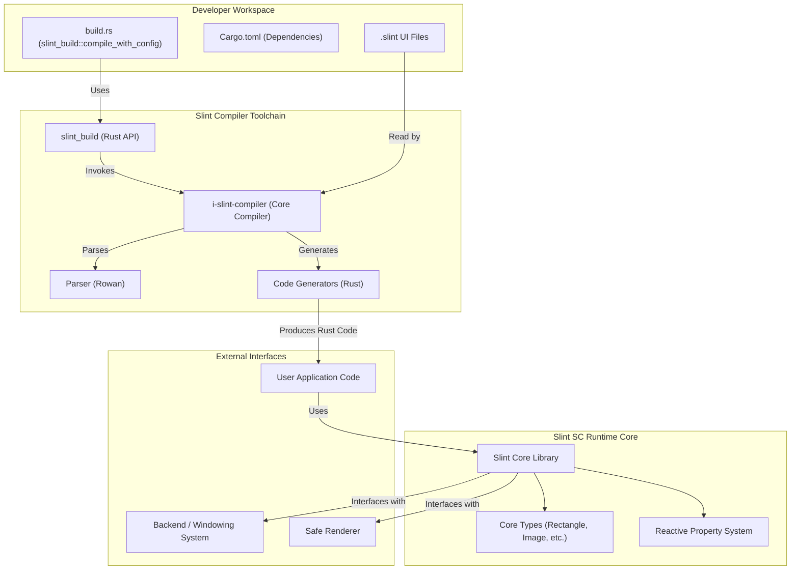
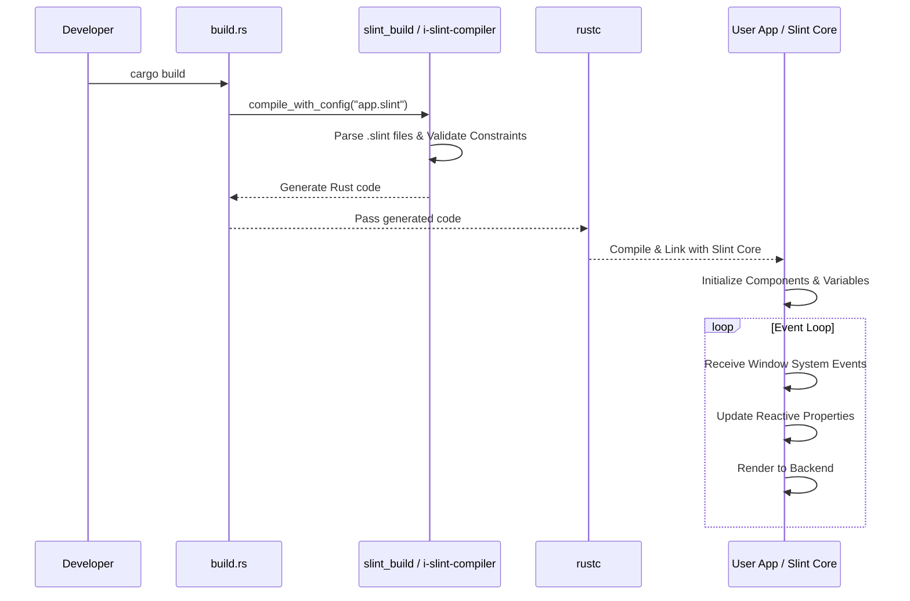

# Slint SC Software Units (ISO 26262:6 7.4.4)

This is what is included in Slint SC:

* A Slint Compiler, from the internal `i-slint-compiler` crate
* The `slint_build` crate which provides a Rust API for the compiler.
* Slint types: Currently we support `Rectangle` and `Image`, with basic properties.
* (TODO: Add list of Rust crates used by Slint SC)

Each of these things can have a **Usage** and a **Constraints** section.

Each feature of the language or a library can map to a Requirement ID, and have 1 or more code test-examples.

## Slint SC Architecture Design (ISO 26262:6 7.4)

During the development of the software architectural design, the following should be considered:

1. Verifiability of the software architectural design.
    This implies bi-directional traceability between the software architectural design and the
    software safety requirements.
2. Simplicity of the design/software (restricted size and complexity)
3. Modularity, Encapsulation, Reusability, Maintainability
4. Feasibility for the design and implementation of the software units
5. Testability of the software
6. Maintainability of the software architectural design

### Static Design

The software architectural design should have a static design part which
addresses:

- the software structure including its hierarchical levels;
- the dependencies;
- the data types and their characteristics;
- the global variables;
- the external interfaces of the software components; and
- the constraints including the scope of the architecture



### Dynamic Design

In addition, the software architectural design should have a dynamic design part which addresses:

- the functional chain of events and behaviour;
- the logical sequence of data processing;
- the control flow and concurrency of processes;
- the data flow through interfaces and global variables; and
- the temporal constraints.



### Safety Analysis Report (ISO 26262:6 7.4.10)

Safety-oriented analysis shall be carried out at the software architectural level in accordance with ISO 26262-9:2018, Clause 8, in order to:

* identify or confirm the safety-related parts of the software; and
* support the specification and verify the effectiveness of the safety measures.

(TODO: Insert Safety Analysis Report here)

# Use Cases (ISO 26262:8 11.4.5.1)

## Using Slint SC in a project

* **ID** : UC_ADD_SLINT_SC_TO_PROJECT
* **Input** : Cargo.toml file in the root of a rust project file tree
* **Output** : Modified Cargo.toml file that includes Slint SC as a dependency
* **Environment Constraints**: (TODO)

When Slint SC is available, it will be a crate on [crates.io](https://crates.io/).
To add it to a project, one simply adds Slint SC as a dependency in `Cargo.toml`.

(TODO - show example)

## Compiling a .slint file into Rust

* **ID** : UC_COMPILE_SLINT_FILE
* **Input** : a .slint file
* **Output** : Rust code that can be compiled into the final executable.
* **Environment Constraints**: (TODO)

Rust developers using Slint SC can instantiate and configure a `CompilerConfiguration` from the [`slint_build`](https://docs.slint.dev/latest/docs/rust/slint_build/) crate to compile `.slint` files into Rust.

This structure is typically created and used from a [Rust build script](https://doc.rust-lang.org/cargo/reference/build-scripts.html), `build.rs`, located in the root directory of the package. After it has the correct
values, it can be passed to `slint_build::compile_with_config`.
Here is a simple example:

```rust
fn main() {
    let mut config = slint_build::CompilerConfiguration::new();
    // [ ... ] set some values on config here
    slint_build::compile_with_config("mainFile.slint", config).unwrap();
}
```

# Constraints

The standard essentially views a **Requirement** as what the system *must do* (or a property it must have), whereas a **Constraint** is a boundary condition that *limits the solution space*.

For APIs, the Constraints might explain that some functions are experimental and can not be used safely yet. Or, that certain values passed as parameters into functions are not supported in Slint SC. In other words, certain features can only be used a certain way to be safe.

The "Slint SC" compiler is the regular Slint compiler with the argument `--safety-critical`.
When the Slint Compiler is used in a safety-critical project, it should impose constraints
on the input programs so that only safe parts of Slint SC can be used, and it should report a proper error message
when an unsafe feature is found.

Individual Constraints can have a section each here, with a descriptive ID that begins with CON_, and a Rationale, Impact, and Mitigation.

## CON_NO_GLOBAL_ALLOCATOR

The Slint SC Compiler should not generate or allow code that uses a global allocator.

**Rationale**: Global allocators can be a source of non-determinism and can make it difficult to reason about the behavior of the generated code.

**Impact**: The generated code may not be deterministic and may not be suitable for use in a safety-critical system.

**Mitigation**: The generated code should not use a global allocator. Instead, it should use a custom allocator that is specific to the generated code.

## CON_NO_DYNAMIC_MEMORY_ALLOCATION

The Slint SC Compiler should not generate or allow code that uses dynamic memory allocation.

**Rationale**: Dynamic memory allocation can be a source of non-determinism and can make it difficult to reason about the behavior of the generated code.

**Impact**: The generated code may not be deterministic and may not be suitable for use in a safety-critical system.

**Mitigation**: The generated code should not use dynamic memory allocation. Instead, it should use a custom allocator that is specific to the generated code.

## CON_NO_UNBOUNDED_RECURSION

The Slint SC Compiler should not generate or allow unbounded recursion.

**Rationale**: Unbounded recursion can be a source of non-determinism and can make it difficult to reason about the behavior of the generated code.

**Impact**: The generated code may not be deterministic and may not be suitable for use in a safety-critical system.

**Mitigation**: The generated code should not use unbounded recursion. Instead, it should use a custom allocator that is specific to the generated code.

## CON_NO_UNSAFE_CODE

The Slint SC Compiler should not generate or allow unsafe code.

**Rationale**: Unsafe code can be a source of non-determinism and can make it difficult to reason about the behavior of the generated code.

**Impact**: The generated code may not be deterministic and may not be suitable for use in a safety-critical system.

**Mitigation**: The generated code should not use unsafe code. Instead, it should use a custom allocator that is specific to the generated code.

