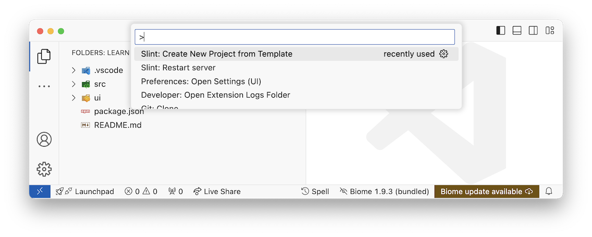
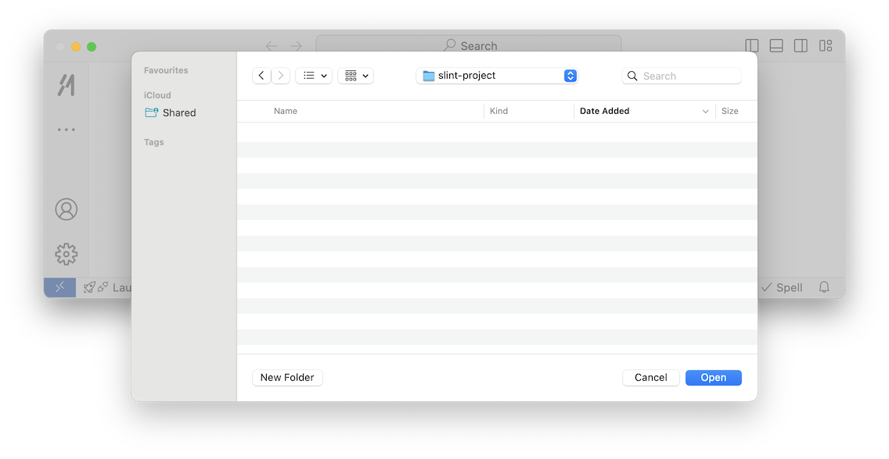

import { Image } from 'astro:assets';
import myImageLight from '/src/assets/mattermost-logo-dark.svg';
import myImageDark from '/src/assets/mattermost-logo-light.svg';
import { Steps, LinkCard, Tabs, TabItem, FileTree } from '@astrojs/starlight/components';

<Image class="light:sl-hidden" src={myImageDark} loading="lazy" width="50" alt="A description of my image." />
<Image class="dark:sl-hidden" src={myImageLight} loading="lazy" width="50" alt="A description of my image." />
As a first step we invite you to join our community on [Mattermost](https://chat.slint.dev/). This is a great place to ask questions and get help from other Slint users.

This guide will help you get started with Slint. It will cover the basics of the language and how to get started with the Slint extension for Visual Studio Code.

## Setting up VSCode

<Tabs syncKey="dev-platform">
<TabItem label="Windows" icon="seti:windows">
<Steps>
1. Install VSCode.  
Download it [here](https://code.visualstudio.com).
2. Install the Slint extension.
Find it [here](https://marketplace.visualstudio.com/items?itemName=Slint.slint).
3. Create a new project based on a Slint template.
This is done via the command palette (Ctrl+Shift+P).
4. Choose your language.
</Steps>
</TabItem>
<TabItem label="macOS" icon="apple">
<Steps>
1. Install VSCode.  
Download it [here](https://code.visualstudio.com).
2. Install the Slint extension.
Find it [here](https://marketplace.visualstudio.com/items?itemName=Slint.slint).
3. Create a new project based on a Slint template.
This is done via the command palette (CMD+Shift+P).
4. Choose your language.

5. Choose a folder to save the project in.

</Steps>
</TabItem>
<TabItem label="Linux" icon="linux">
<Steps>
1. Install VSCode.  
Download it [here](https://code.visualstudio.com).
2. Install the Slint extension.
Find it [here](https://marketplace.visualstudio.com/items?itemName=Slint.slint).
3. Create a new project based on a Slint template.
This is done via the command palette (Ctrl+Shift+P).
4. Choose your language.
</Steps>
</TabItem>

</Tabs>

### Slint project structure

<Tabs syncKey="dev-language">
<TabItem label="C++" icon="seti:cpp">

<FileTree>

- .vscode/
- src/
  - main.cpp
- ui/
  - app-window.slint  The **main** Slint file
- CMakeLists.txt
- LICENSE
- README.md

</FileTree>

</TabItem>
<TabItem label="NodeJS" icon="seti:javascript">

<FileTree>

- .vscode/
- src/
  - main.js
- ui/
  - app-window.slint  The **main** Slint file
- package.json
- README.md

</FileTree>
</TabItem>
<TabItem label="Rust" icon="seti:rust">

<FileTree>

- .vscode/
- src/
  - main.rs
- target/
  - debug/
  - .rustc_info.json
  - CACHEDIR.TAG
- ui/
  - app-window.slint  The **main** Slint file
- build.rs
- Cargo.Toml
- LICENSE
- README.md

</FileTree>

</TabItem>
</Tabs>

The `src` folder is for the apps business logic. While the `ui` folder contains the Slint files that define the user interface.
