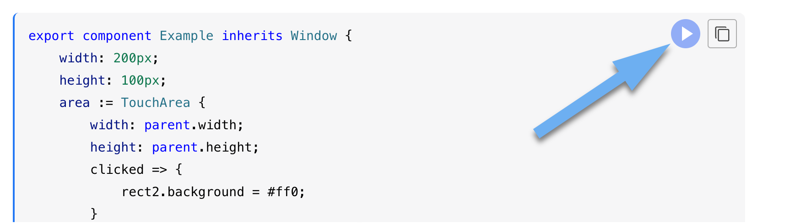
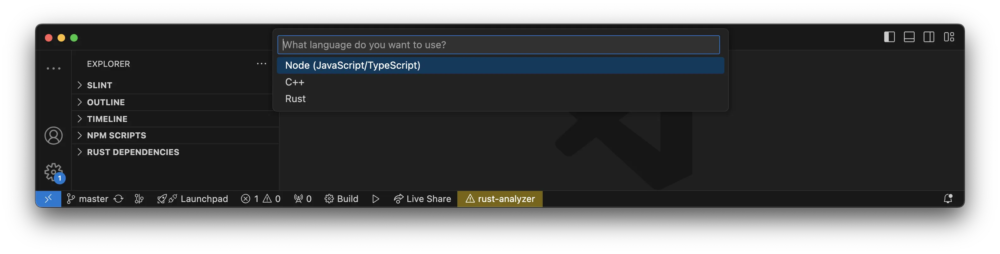

import { Steps, LinkCard, Tabs, TabItem, FileTree } from '@astrojs/starlight/components';

## Understanding the documentation

:::note[Note]
Slint provides a web based live-editing tool called [SlintPad](https://slintpad.com). It's 
possible to open the larger snippets in this tool by clicking the `play` button in the top right 
corner of the snippets.

:::

If you are new to Slint and want to quickly get started and learning the basics we recommend 
using Visual Studio Code (VS Code). VS Code is popular, free and thanks to the Slint extension 
it is also the easiest to get started with.

:::tip[Tip]
We support many other tools and editors see [here](https://github.com/slint-ui/slint/blob/master/editors/README.md#editors).
:::

## Setting up VS Code

<Tabs syncKey="dev-platform">
<TabItem label="macOS" icon="apple">
<Steps>
1. **Install VS Code.**   
Download it [here](https://code.visualstudio.com).

2. **Install the Slint extension.**  
Find it [here](https://marketplace.visualstudio.com/items?itemName=Slint.slint).

3. **Create a new project based on a Slint template.**  
This is done via the command palette (CMD+Shift+P).

4. **Choose your language.**

5. **Choose a folder to save the project in.**  

</Steps>
</TabItem>
<TabItem label="Linux" icon="linux">
<Steps>
1. **Install VS Code.**  
Download it [here](https://code.visualstudio.com).

2. **Install the Slint extension.**  
Find it [here](https://marketplace.visualstudio.com/items?itemName=Slint.slint).

3. **Create a new project based on a Slint template.**  
This is done via the command palette (Ctrl+Shift+P).

4. **Choose your language.**  
</Steps>
</TabItem>
<TabItem label="Windows" icon="seti:windows">
<Steps>
1. Install VS Code. 
Download it [here](https://code.visualstudio.com).

2. Install the Slint extension.
Find it [here](https://marketplace.visualstudio.com/items?itemName=Slint.slint).

3. Create a new project based on a Slint template.
This is done via the command palette (Ctrl+Shift+P).

4. Choose your language.

</Steps>
</TabItem>
</Tabs>

### Slint project structure

<Tabs syncKey="dev-language">
<TabItem label="C++">

<FileTree>

- .vscode/
- src/
  - main.cpp
- ui/
  - app-window.slint  The **main** Slint file
- CMakeLists.txt
- LICENSE
- README.md

</FileTree>

</TabItem>
<TabItem label="NodeJS">

<FileTree>

- .vscode/
- src/
  - main.js
- ui/
  - app-window.slint  The **main** Slint file
- package.json
- README.md

</FileTree>
</TabItem>
<TabItem label="Rust">

<FileTree>

- .vscode/
- src/
  - main.rs
- target/
  - debug/
  - .rustc_info.json
  - CACHEDIR.TAG
- ui/
  - app-window.slint  The **main** Slint file
- build.rs
- Cargo.Toml
- LICENSE
- README.md

</FileTree>

</TabItem>
</Tabs>

The `src` folder is for the apps business logic. While the `ui` folder contains the Slint files that define the user interface.
