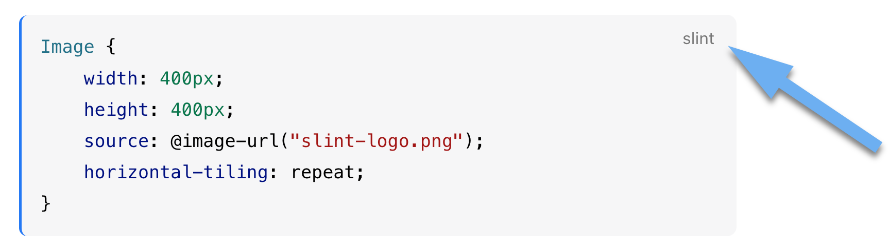
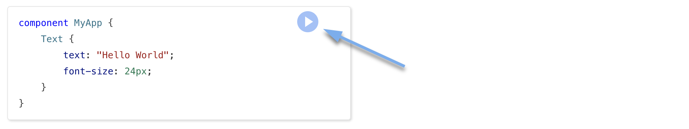
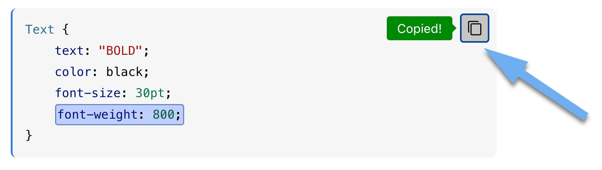
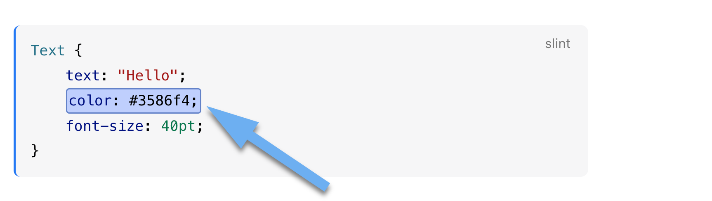

import { Steps, LinkCard, Tabs, TabItem, FileTree } from '@astrojs/starlight/components';

The documentation includes a lot of code snippets. The language hint lets you know what
language the snippet is written in.

Some snippets of Slint code are interactive. You can click the `run` button to run the snippet
in a web based live-editing tool called [SlintPad](https://slintpad.com).

To easily copy the text of a snippet use the copy button.

Examples that want to help focus on a specific part of the code will have highlights. They are only
a documentation feature and you won't see this kind of highlight when writing your own code.

