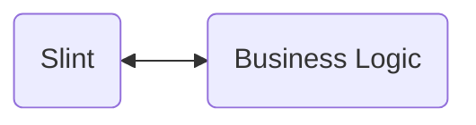

Slint is a GUI toolkit for building modern fluid user interfaces for embedded devices, as well as desktop and mobile applications.

Slint ties together many of todays most modern, powerful and popular UI language techniques to provide a simple, yet powerful, declarative language for building user interfaces. It's also been designed with the
aim to help ensure your application stays maintainable over time. So you can rapidly prototype and iterate
your initial design, refine them into a final product and keep evolving that over time with less effort.

### A Single UI Language for all products
There is only one Slint UI language. Regardless of the target platform be it an ultra-low-power microcontroller, a desktop application, or a mobile application, the same language is used to describe the user interface.

### Powerful UI renderer.
Slint provides its own UI render layer. It's optimized for power efficiency and low memory usage. Offering a software renderer for platforms without a GPU and a hardware renderer for platforms with a GPU.

### Visual Tooling
Code is a great abstraction for describing the user interface, however it's possible to translate that in your head into a visual representation. This is where Slint's visual tooling comes in. It provides a live preview of your application, so you can see the result of your changes in real time. This ins't a simulation or an emulation, but a real-time preview of your application.

### Separate Business Logic
The business logic can then be written with Rust, C++ or TypeScript. 

### Bridge between the two worlds.
Slint also provides a simple way to bridge the gap between the business logic and the UI.

