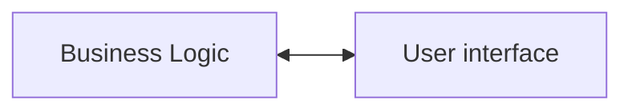

# Welcome to Slint

The following is a guide to Slint. It's been written to help you get both started 
with Slint, understand the thinking behind it, and what makes it unique compared 
to other UI frameworks.

## Your Apps Business Logic is your Business

Mermaid diagram showing split between business logic and UI

The past few decades have seen a lot of UI innovation, but also the world of UI frameworks 
has become unnecessarily complex. One persistent problem is that it can be relatively quick
to get started but overtime an app becomes unmaintainable or costly to update. Another is
that different tools and technologies are used for an initial prototype and the final production
ready product. Finally that while the mobile, desktop and web have easy to use frameworks the
embedded world still looks similar to the software landscape of decades past with Java and C based
tech. 

Slint is a new approach to UI development. It is a declarative language that is easy to learn and 
start with. It is also easy to prototype and iterate your initial design. But to then go further. 
To refine everything into a final product that is easy to maintain and can be constantly evolved.
It provides everything you expect from a modern UI framework, but with one significant difference.
The apps business logic, things like data storage, processing, networking and more is kept separate
from the Slint UI language. Unlike other declarative frameworks such as React you cannot mix the UI
and the imperative code e.g. HTML + CSS + Javascript. Instead you develop the business logic in Rust, 
C++ or TypeScript and then use the Slint UI language to describe the UI. Slint also provides a way 
for the two sides to easily communicate.

This isn't the first time a UI language has been separated from the business logic. But unlike
previous 'code behind' approaches, Slint is not an XML or HTML static language. It's a hybrid
of declarative language that brings the ease of a markup language with a sprinkle of imperative
and data binding magic that makes it easy to build complex and dynamic UI's.
