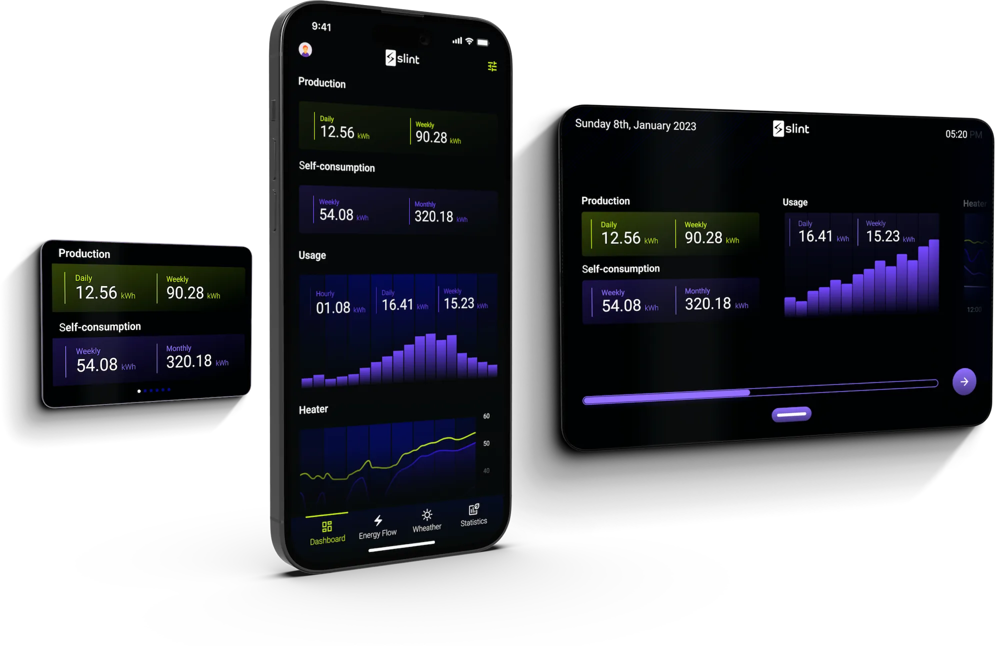

import { LinkButton, LinkCard } from '@astrojs/starlight/components';
import { Image } from 'astro:assets';
import mattermostLogoLight from '/src/assets/mattermost-logo-dark.svg';
import mattermostLogoDark from '/src/assets/mattermost-logo-light.svg';
import ThreeCardGrid from '../../components/ThreeCardGrid.astro';

<ThreeCardGrid>
<LinkCard
  title="VS Code Quick Start"
  href="/master/docs/slint/getting-started/intro"
  description="Follow along with our VsCode extension and live code tooling."
/>
<LinkCard
  title="Guide"
  href="/master/docs/slint/guide/intro"
  description="Learn the basics of Slint."
/>
<LinkCard
  title="Tutorial"
  href="/master/docs/slint/tutorial/quickstart"
  description="Follow along with our tutorial."
/>
</ThreeCardGrid>

## More resources

<Image class="light:sl-hidden" src={mattermostLogoDark} loading="lazy" width="50" alt="Mattermost logo" />
<Image class="dark:sl-hidden" src={mattermostLogoLight} loading="lazy" width="50" alt="Mattermost logo" />
As a first step please join our community on [Mattermost](https://chat.slint.dev/). This is a great place to ask questions and get help from other Slint users.
