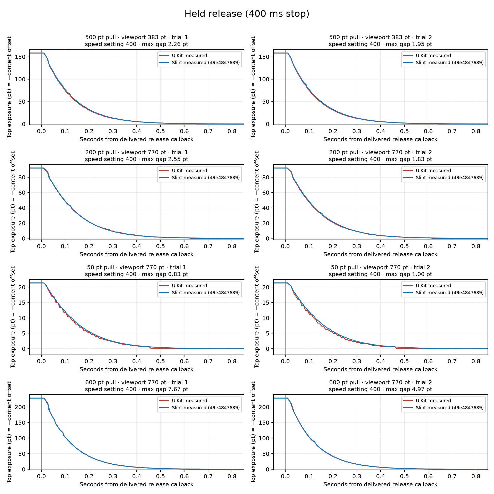
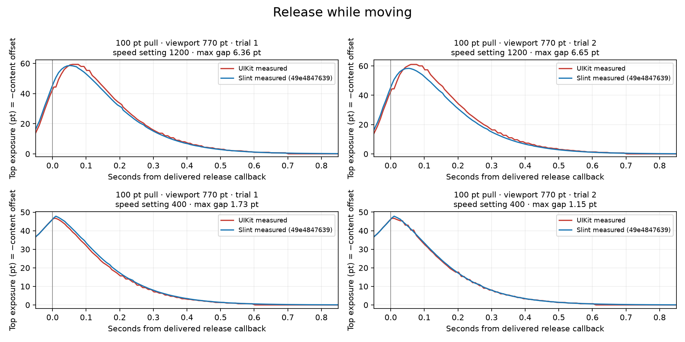
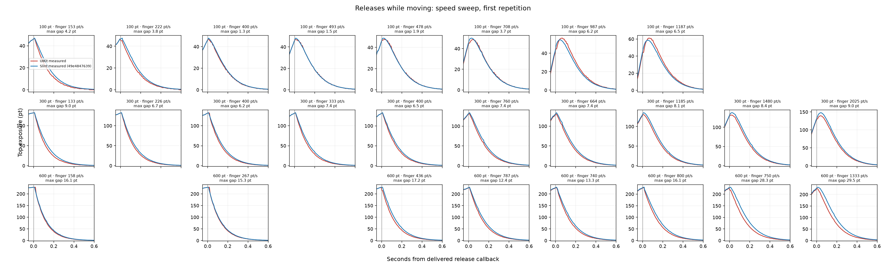

<!-- cspell:ignore Murmele murmele xcodegen xcresult CADisplayLink -->
# UIKit Release-Speed Sweep

All 64 requested iPhone captures completed and passed delivery and timing qualification.
The new fade improves the short fast release, but larger pulls still show substantial position differences.
No engine code or fitted constants changed during this campaign.

## Tested Source and Device

- Engine: [`49e4847639`](https://github.com/Murmele/slint/commit/49e48476397b3498d2313812c707b45f637d0584), frozen before the run.
- Request: [REQUEST.md](REQUEST.md), executed on October 2, 2026.
- Device: iPhone 13 Pro Max, iPhone14,3; iOS 27.0, build 24A437.
- Release build, Cupertino style, Winit with Skia.
- Actual paired viewport heights: 770 and 383 points; geometry and content sizes match.
- Two screen-test methods passed: 12 validation captures and 52 sweep captures, in 745.275 seconds total.
- All 25 simulation unit tests passed before the phone run.
- Missing cases: none. Failed cases: none. Gesture replacements: none.

Qualification checks delivery, geometry, initial offset, sampling gaps, and final rest.
It does not assert UIKit parity.
None of the 64 curves stayed within 0.5 point throughout the return.

Median sampling intervals range from 8.28 to 8.43 ms; the largest gap is 17.58 ms.
Moving releases stop for at most 9.09 ms, within the existing 30 ms delivery guard.
We retain every capture, including any transient discrepancies.

## Validation Cases

The held release positions still agree within 0.15 point.
These maximum gaps cover 0–1.5 seconds after the delivered release callback.
Each case has two repetitions.

| Pull / Actual Viewport | Release | Maximum Gap, Trial 1 / 2 |
| --- | --- | ---: |
| 50 / 770 pt | 400 ms stop | 0.827 / 1.002 pt |
| 200 / 770 pt | 400 ms stop | 2.545 / 1.827 pt |
| 600 / 770 pt | 400 ms stop | 7.666 / 4.967 pt |
| 500 / 383 pt | 400 ms stop | 2.264 / 1.946 pt |
| 100 / 770 pt | Moving, speed setting 400 | 1.726 / 1.150 pt |
| 100 / 770 pt | Moving, speed setting 1200 | 6.355 / 6.650 pt |

The 100-point fast validation release now has a 6.36–6.65 point maximum gap.
The preceding release-velocity implementation had a 10.24–12.04 point gap in that case.
These are separate device captures, not replayed identical events.

## Speed-Sweep Results

The speed settings request automation duration; they are not measured release velocities.
The summary records both the delivered finger speed over the final 25 ms and UIKit's pan-recognizer velocity.
Those measurements can differ, and neither logs Slint's internal velocity estimate.

| Pull Distance | Captures | Delivered Final-25-ms Finger Speed | Median Maximum Gap | Worst Maximum Gap | Median Per-Curve RMS |
| --- | ---: | ---: | ---: | ---: | ---: |
| 100 pt | 16 | 133.4–1209.5 pt/s | 3.730 pt | 6.475 pt | 0.829 pt |
| 300 pt | 20 | 129.7–2024.5 pt/s | 7.453 pt | 11.097 pt | 2.684 pt |
| 600 pt | 16 | 158.5–1333.4 pt/s | 16.137 pt | 29.504 pt | 4.917 pt |

The largest gap is 29.504 points in `sweep-vp774-d600-v2000-hold0-trial1`.
The second repetition reaches 24.824 points.

The 600-point sweep reaches only about 1,333 points per second by the final-25-ms measure.
Its requested 2,000 setting produces UIKit pan estimates of about 1,177–1,216 points per second.
The 300-point sweep reaches about 2,025 points per second by the final-25-ms measure.
Do not treat equal requested settings as matched delivered speeds or infer a universal distance effect from this table.

Some first post-release samples are already inside the exposure logged at release, producing negative additional-exposure values.
We keep those values and the corresponding position traces rather than forcing peaks or timing to align.
The sweep provides evidence for fitting the fade afterward; it does not establish the fade's final shape or distance dependence.

All figures use actual points and seconds from the delivered release callback.
There is no curve-specific shift, distance normalization, or time normalization.
The CSV retains both repetitions; the sweep figure shows the first repetition of each cell.

## Evidence and Reproduction

- [Sweep summary: 52 measured releases](evidence/sweep-summary.csv)
- [All 64 paired position traces](evidence/paired-positions.csv)
- [Per-case qualification, velocities, and metrics](evidence/latest-validation.json)
- [Analysis script](scripts/analyze_latest.py)
- [Fixture generator and both test methods](scripts/prepare_fixture.py)
- [Earlier release-velocity report](https://github.com/Murmele/slint/blob/59c6ec118e82427ebd772f852be48c9cad4e76ea/tests/manual/ios-scroll-physics-comparison/report/FINDINGS.md)

The earlier report and evidence remain available in Git history.
We overwrote the requested result files and did not run `compare_runs.py`.
Raw touch events, absolute device timestamps, logs, and `.xcresult` bundles remain local.

[Source-clock comparison](figures/source-clock-comparison.png) replays the earlier native held-pull dataset with zero release velocity.
It is separate from the new sweep and uses the fixed source coefficients.

Reproduce the capture and analysis using [REQUEST.md](REQUEST.md).
Pass `--engine-commit 49e48476397b3498d2313812c707b45f637d0584` when analyzing these recordings.
The successful result bundle is `/private/tmp/slint-mm-sweep-49e4847639-phone.xcresult`.
