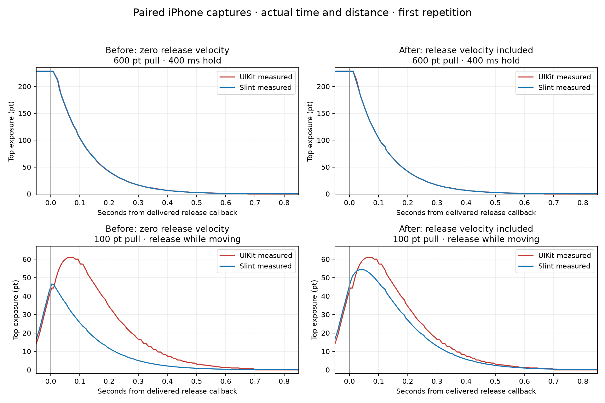

<!-- cspell:ignore af6e8e7c cc987e7d Murmele murmele uikit CADisplayLink xcresult xcodegen Matplotlib -->
# Latest Murmele Branch: Measured iPhone Behavior

The new release-velocity handling substantially improves moving releases.
It supplies the outward motion that was previously missing, but the fast return still has a different amplitude and timing.

## Tested Source and Scope

Engine: [`af6e8e7c35`](https://github.com/Murmele/slint/commit/af6e8e7c357f7eec5e894cfaac8390c04fd104e3), fetched from `Murmele/slint: mm/flickable-scroll-animation-v2` on October 2, 2026.
The comparison build uses the exact engine checkout, without our experimental spring changes.
The preceding measured build is [`69f715ea1e`](https://github.com/Murmele/slint/commit/69f715ea1e83de0ee3f0c6d1d2cbb435b6981495), with the same 7 ms delay but no moving-release velocity.

The physical campaign covers pulling beyond the top edge and releasing, with and without a stop.
It does not rerun the historical carried-momentum, flick-start threshold, or flick-to-boundary phone campaigns.
The branch's related unit and bounce regressions are included below.

## Verification

| Check | Result |
| --- | --- |
| Simulation unit tests | 23 passed, including all nine spring tests |
| Flick-animation unit tests | Five passed: carried momentum, zero viewport, and batching-independent rubber-band paths |
| Rust `flickable-bounce.slint` regression | Nine passed, including the new moving-versus-held release check |
| Selected Release iPhone screen test | Passed in 146.09 seconds; 12 paired captures |
| Trace qualification | All 12 passed; no replacements |

The source regression asserts outward continuation and eventual rest.
It does not compare UIKit's full curve.
The phone screen-test assertions check delivery and final rest, rather than animation parity.

The device is an iPhone 13 Pro Max running iOS 27.0 build 24A437.
Both views use equal geometry and content sizes, starting at offset zero.
Actual viewport heights are 770 and 383 points.
The build uses Release, Cupertino style, and Winit with Skia.

Delivered held-stop durations are 400.00–408.33 ms; moving-stop durations are 0–0.07 ms.
Median sample intervals are 8.28–8.40 ms, with an 18.06 ms maximum gap.
No trace exceeded the 30 ms sampling-gap guard.
Positions are sampled together in one display-link callback.

## Paired Before and After

Each error is the maximum simultaneous position difference over 0–1.5 seconds after the delivered release callback.
Each case has two fresh repetitions.
Speed settings control requested automation duration; they are not measured release velocities.
Held pulls use at least 0.5 seconds of motion.

| Pull / Viewport | Stop | Speed Setting | Trial | Before: No Release Velocity | Latest: Release Velocity |
| --- | --- | ---: | ---: | ---: | ---: |
| 50 / 770 pt | 400 ms | 400 | 1 | 0.803 pt | 0.838 pt |
| 50 / 770 pt | 400 ms | 400 | 2 | 0.981 pt | 0.974 pt |
| 200 / 770 pt | 400 ms | 400 | 1 | 1.704 pt | 2.446 pt |
| 200 / 770 pt | 400 ms | 400 | 2 | 1.167 pt | 2.347 pt |
| 600 / 770 pt | 400 ms | 400 | 1 | 3.757 pt | 4.655 pt |
| 600 / 770 pt | 400 ms | 400 | 2 | 2.702 pt | 3.691 pt |
| 500 / 383 pt | 400 ms | 400 | 1 | 2.042 pt | 1.662 pt |
| 500 / 383 pt | 400 ms | 400 | 2 | 2.258 pt | 3.521 pt |
| 100 / 770 pt | None | 400 | 1 | 6.970 pt | 1.144 pt |
| 100 / 770 pt | None | 400 | 2 | 8.122 pt | 1.168 pt |
| 100 / 770 pt | None | 1200 | 1 | 33.661 pt | 12.040 pt |
| 100 / 770 pt | None | 1200 | 2 | 33.688 pt | 10.240 pt |



All charts retain actual points and seconds from the delivered release callback.
We apply no curve-specific time shifts and no distance or time normalization.
Before and after are separate physical captures, not a replay of identical device events.

## Moving Releases

The slower setting improves from a 6.97–8.12 point maximum gap to 1.14–1.17 points.
UIKit's delivered pan-recognizer velocity is 400.00–406.03 points per second in the new traces.
Slint adds about 1.3 points of outward travel after release; UIKit adds none at this speed.
Their positional settling times agree to within one sampled frame.

The faster setting improves from a 33.66–33.69 point maximum gap to 10.24–12.04 points.
UIKit's delivered pan-recognizer velocity is 1224.00–1248.91 points per second in the new traces.
These values describe UIKit's estimator, not Slint's internal velocity estimate.

| Fast Moving Release | UIKit, Trial 1 / 2 | Slint, Trial 1 / 2 |
| --- | ---: | ---: |
| Additional outward travel after release | 16.667 / 14.667 pt | 7.910 / 7.977 pt |
| Peak displayed top exposure | 61.000 / 60.000 pt | 54.420 / 54.487 pt |
| Time of first sampled peak | 0.0599 / 0.0599 s | 0.0431 / 0.0436 s |
| Sustained positional return within 0.5 pt | 0.7021 / 0.7017 s | 0.6770 / 0.6767 s |

Slint now continues outward before returning.
However, it reaches a smaller peak about 16–17 ms earlier and reaches the positional settling criterion about 25 ms earlier.
Peak timestamps are sampled positions, not exact continuous-time turnarounds.


## Held Releases

Held-release positions remain within 0.15 point of UIKit at release.
Maximum return gaps range from 0.84 to 4.66 points.
The larger held returns have low overall RMS error, but transient position differences remain.

Some held maximum gaps increased versus the previous capture, while others decreased.
With two repetitions and different sampled frame phases, this does not establish a repeatable held-return regression.
For zero release velocity, the new source evaluates the same stopped-pull formula and delay as the preceding implementation.
We do not log the internal per-release Slint velocity estimate in this fixture.


None of the 12 paired traces stayed within 0.5 point throughout the return.

## What the Source and Measurements Establish

The outside-bounds path now passes Slint's estimated pointer velocity into the spring.
It converts that velocity to displayed-content velocity through the rubber-band slope.
The spring retains outward velocity during the 7 ms delay and combines it with the fitted return initialization.
Motion toward the limit is discarded by the constructor.

The previously missing outward phase is fixed, and the moving-release curve is substantially closer to UIKit.
The high-speed amplitude and turnaround timing are still wrong in these measured cases.
We have not isolated whether the remaining error comes from the velocity estimator, its transformation, the fitted return initialization, or their combination.

The next focused diagnostic would log Slint's estimated pointer velocity and transformed content velocity at release.
Compare these with observed early displayed-content motion, then test the spring with a known initial content velocity.
The existing branch tests establish internal behavior, but passing them is not proof of UIKit parity.

These measurements read content offsets, rather than rendered pixels.
We made no engine changes during this campaign.
The tested app was reopened at the top of both lists for manual inspection.

## Evidence and Reproduction

- [Qualification and metrics](evidence/latest-validation.json)
- [Paired position CSV](evidence/paired-positions.csv)
- [Before/after comparison](evidence/release-velocity-comparison.json)
- [Analysis script](scripts/analyze_latest.py)
- [Comparison figure script](scripts/compare_runs.py)
- [Test summary](evidence/test-summary.json)
- [Capture fixture preparation](scripts/prepare_fixture.py)
- [Previous paired positions](evidence/previous-paired-positions.csv)
- [Previous qualification and metrics](evidence/previous-validation.json)

Raw touch events, absolute timestamps, device logs, and the `.xcresult` bundle remain local.
The published position CSVs contain relative clocks and both content offsets from automated captures.
The native replay in the metrics JSON evaluates only held pulls with zero release velocity.
It is separate from the new paired moving-release measurements.

Run the scoped source regression directly from the engine checkout:

```sh
SLINT_TEST_FILTER=flickable-bounce.slint SLINT_NO_QT=1 cargo test --release \
  --manifest-path tests/Cargo.toml -p test-driver-rust --no-default-features \
  --features build-time --test elements
cargo test --release -p i-slint-core --lib animations::simulations
cargo test --release -p i-slint-core --lib items::flickable::animation::tests
```

Prepare the capture app from the archived harness, while linking its Cargo dependencies to the engine checkout:

```sh
python3 tests/manual/ios-scroll-physics-comparison/report/scripts/prepare_fixture.py \
  --source-root "$PWD" --fixture-dir /private/tmp/slint-release-velocity-fixture
cd /private/tmp/slint-release-velocity-fixture
xcodegen generate
```

The helper needs harness commit `cc987e7d93d841c09f52d416044d2ca6fc35691f` in the local object database.
Fetch `murmele/nigel/ios-uikit-scroll-parity-mm` if that commit is unavailable.
It copies only app files; it does not replace the current engine.

Run only `NativeSlintScrollUITests/ScrollComparisonTests/testMurmeleLatestSpringValidation` on the attached phone in Release.
The selected method uses the same six cases as the prior campaign, with scenario prefix `latest-af6e8e`.
Collect each scenario's input CSV, scroll CSV, and geometry JSON into a local raw directory.
Use Python with NumPy and Matplotlib to regenerate the measured figures:

```sh
python3 tests/manual/ios-scroll-physics-comparison/report/scripts/analyze_latest.py \
  --source-root "$PWD" --raw-dir /path/to/local/raw \
  --output-dir tests/manual/ios-scroll-physics-comparison/report
python3 tests/manual/ios-scroll-physics-comparison/report/scripts/compare_runs.py
```

The analysis checks the spring source against the tested commit before replaying it.
The comparison script regenerates the before/after figure and aggregates from the published relative-position CSVs and metrics.
