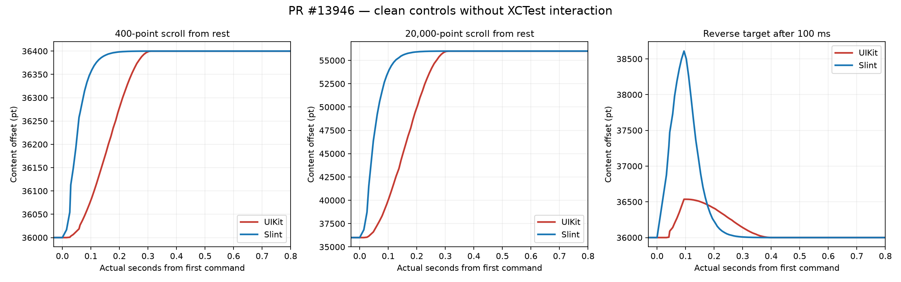

<!-- Copyright © SixtyFPS GmbH <info@slint.dev> -->
<!-- SPDX-License-Identifier: MIT -->
<!-- cspell:ignore Murmele Winit Skia XCTest devicectl UIKit -->

# PR #13946 — iPhone Results, October 9, 2026

Tested PR head: `0bbd6bd8d58ebe3c029eec2820d109952cac6766`, Murmele's `mm/scroll-to`.
Release, Cupertino style, Winit/Skia; iPhone 13 Pro Max, iOS 27.0.1 (24A446).
No engine or test-source changes were made.

All six XCTest methods passed and saved all 76 requested captures.
All lists reached their final targets and were at rest by the end of the captures.
The six methods assert saved traces, not native animation parity.

## Capture Quality

**All 64 launch-triggered captures have an animation-time sampling gap, usually near 240 ms and up to 270.599 ms.**
The 12 release-triggered captures have no sampling gap over 30 ms.
The automated launch-triggered curves are retained but are not accepted as clean timing evidence.

Three controls launched the exact same app through devicectl without XCTest interaction.
All three controls pass the collector's quality checks.
This points to launch/automation interference, but doesn't isolate the exact blocking call.

## Clean Controls

| Control | Maximum post-command gap (ms) | UIKit 90% time (ms) | Slint 90% time (ms) | UIKit settle (ms) | Slint settle (ms) |
| --- | ---: | ---: | ---: | ---: | ---: |
| distance0400-trial3 | 11.412 | 253 | 111 | 311 | 236 |
| distance20000-trial3 | 15.949 | 252 | 111 | 312 | 353 |
| delay0100-trial3 | 10.371 | n/a | n/a | 403 | 386 |

Settling means remaining within 0.5 points of the final observed offset.
The reverse-retarget row measures settling from the first command; the second command occurs at 100 ms.
There is one control per scenario, not a completed rerun of the matrix with fixed automation.
Both from-rest controls show Slint reaching 90% substantially earlier than UIKit.

## Replay and Fitting

The supplied host replay failed at `replay/tests/replay.rs:55`.
Its CSV reader uses comma splitting and mishandles the collector's quoted device field.
The parser treats the iOS version text as `viewport_pt` and raises `invalid float literal`.
No replay curves were produced.
The supplied fitting script completed and wrote `cases/fit-from-rest.csv`.
**Its automated from-rest inputs have sampling-gap flags, so the fits remain provisional and should not calibrate native animation timing.**

## Published Evidence

- [Original matrix CSVs](../../cases/), including all quality flags.
- [Clean control CSVs](diagnostic/cases/) and [their measurements](diagnostic/summary.json).
- [Quality counts by case](capture-quality.json).
- [Run provenance and status](metadata.json).

Raw recordings, absolute device clocks, touch identities, logs, and the `.xcresult` bundle remain local.
The engine and test source are unchanged.
The controls retain trial number 3 and live outside the original case folders to preserve the 76-capture matrix.

## Reproduction

Run the tests and processing described in the [harness README](../../README.md) at the tested engine commit.
For each control, launch the same app with `devicectl device process launch` and the corresponding parameters below.
Wait until it saves the trace without querying its accessibility hierarchy.
Process the control's files separately with `scripts/collect.py`'s `collect`, `update_summary`, and `plot` functions.

Common control settings are `START_OFFSET=36000`, `VIEWPORT_HEIGHT=774`, and `SCROLL_TO_ANCHOR=launch`.
Use `PLAN_START_DELAY_MS=1500`, `PLAN_LEAD_IN_MS=300`, `INPUT_TRACE=0`, Cupertino style, and Winit/Skia.

| Scenario | Scroll-to commands | Save delay (ms) |
| --- | --- | ---: |
| `case01-distance0400-trial3` | `0:36400` | 3000 |
| `case01-distance20000-trial3` | `0:56000` | 3000 |
| `case05-delay0100-trial3` | `0:39000;0.1:36000` | 3100 |

Set the scenario with `SCROLL_SCENARIO`, commands with `SCROLL_TO_COMMANDS`, and save delay with `TRACE_SAVE_DELAY_MS`.

