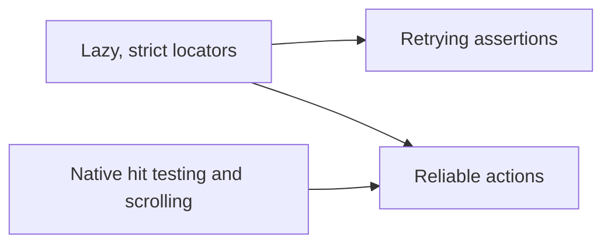

# Slint Python Test Roadmap

## Purpose

This document defines the readable Python test API explored with the Visual Editor.
It separates reusable Slint testing features from application integration conventions and Visual Editor helpers.
It also records the behavior changes, remaining correctness work, and the path toward a supported framework API.

The experiment keeps pytest and ordinary Python files as the source of truth.
[Test Studio](../test-studio/README.md) runs and visualizes those tests, but doesn't define their syntax.
The [generic API reference](README.md) documents the implemented experimental surface.
The [Test Studio roadmap](../test-studio/ROADMAP.md) covers the runner, debugger, recorder, and distribution work.

## Recommendation

Keep three layers with one-way dependencies:

| Layer | Ownership | Examples |
| --- | --- | --- |
| Slint test framework | Generic mechanics for any Slint application | Locators, waiting, input, assertions, screenshots, action traces |
| Application testability contract | Conventions an application follows for reliable automation | Semantic roles, stable names, readiness, isolated state |
| Visual Editor adapter | Visual Editor concepts and synchronization | Canvas elements, inspector fields, outline rows, source updates |

`slint_test` can incubate the generic Python API inside this repository.
It doesn't need to enter the installed `slint_testing` package before users can evaluate it.
The Visual Editor adapter can use the experiment while the API changes.
The proven generic parts can then move into a supported package.

Some work can't remain a Python helper.
Hit testing, effective clipping, scrolling, stale-handle rejection, and atomic input dispatch need runtime or transport support.

## The Three Highest-Value Generic Changes

The three changes build on each other:



All three belong in a generic Slint testing API.
They are useful for the Visual Editor, galleries, examples, and unrelated Slint applications.

### 1. Lazy, Strict Locators

A locator describes how to find an element.
It resolves when a test reads or acts on the element.
Repeated operations query the current UI instead of retaining one element handle.

Before:

```python
text = window_element_with_label(
    window,
    "Property sample text",
    slint_testing.AccessibleRole.TextInput,
)
text.accessible_value = "From the sidebar"
```

After:

```python
text = window.get_by_role(
    "text-input",
    name="Property sample text",
)
text.set_accessible_value("From the sidebar")
```

The locator makes the target readable and keeps the lookup with the action.
It also survives a component rebuild when the replacement exposes the same semantics.

The generic contract should include:

- role, accessible name, and stable identifier locators
- nested scopes, `filter(has=...)`, and `nth(...)`
- strict unique matching by default
- useful missing-target and ambiguous-target diagnostics
- lazy property reads, counts, and explicit `wait_for()`
- action-time re-resolution after a stale target

The current experiment implements this contract.
The remaining framework work is to expose typed transport errors and stronger stable identity.

### 2. Retrying Assertions

Slint applications update asynchronously.
An assertion should wait for its condition instead of requiring every test to write a polling loop.

Before:

```python
wait_until(
    lambda: (
        True
        if window_element_with_label(
            window,
            "Sample editable field",
            slint_testing.AccessibleRole.TextInput,
        ).accessible_value
        == "From the sidebar"
        else None
    )
)
```

After:

```python
sample = window.get_by_role(
    "text-input",
    name="Sample editable field",
)
expect(sample).to_have_value("From the sidebar")
```

Waiting for disappearance becomes equally direct.

Before:

```python
wait_until(
    lambda: (
        True
        if not elements_with_label(window.root_element, "Close Custom")
        else None
    )
)
```

After:

```python
expect(
    window.get_by_accessible_name("Close Custom")
).to_be_hidden()
```

The generic contract should cover values, names, descriptions, visibility, selection, enabled state, counts, and geometry.
It should also support polling arbitrary application state and checking that a value remains stable.

```python
expect.poll(read_saved_bytes, message="saved source").to_equal(expected_bytes)
expect.poll(read_saved_bytes).to_remain(original_bytes, for_ms=250)
```

Failures must preserve the expected value, last observation, target, timeout, and source location.
Studio can render the same structured diagnostic as `expected 250, observed 200` without parsing traceback text.

The current experiment implements these assertions and structured comparisons.

### 3. Reliable Actions With Actionability Waiting

Actions should wait until their target can receive the requested input.
Tests shouldn't duplicate focus, clearing, typing, stabilization, or cleanup logic.

Before:

```python
field = window_element_with_label(
    window,
    label,
    slint_testing.AccessibleRole.TextInput,
)
current_value = field.accessible_value
field.invoke_accessible_default_action()

for _ in current_value:
    press_key(window, keys.Delete)

for character in value:
    press_key(window, character)

return wait_until(
    lambda: field if field.accessible_value == value else None
)
```

After:

```python
field = window.get_by_role("text-input", name=label)
field.fill(value)
expect(field).to_have_value(value)
```

Pointer and keyboard actions become readable as well.

Before:

```python
search.single_click(slint_testing.PointerEventButton.Left)
press_keys(window, "Text")
```

After:

```python
search.click()
window.keyboard.press_sequentially("Text")
```

The Python layer should provide `click`, `dblclick`, `fill`, `clear`, key presses, drag, and scroll.
It should share one operation deadline and always release held buttons and modifiers during cleanup.

Native support should determine whether a pointer target is stable, visible, unclipped, and uncovered.
It should scroll a target into view and check the target again after hover callbacks.
Unsupported custom input routing should fail explicitly instead of guessing.

The experiment implements checked left clicks for supported built-in input policies.
It also implements nested `Flickable` scrolling and a deliberate forced-click escape hatch.
The private protocol extension must move into the supported Python transport before this becomes a stable API.

## Where Each Feature Belongs

### Slint Test Framework

The framework should own behavior that applies without knowing the application domain:

- application launch, stop, cancellation, and child-process cleanup
- window discovery and element inspection
- locators by role, name, identifier, scope, relationship, and index
- operation deadlines, waiting, and cancellation checks
- visibility, enabled state, geometry stability, and pointer actionability
- hit testing, effective clipping, overlay detection, and scrolling
- pointer, keyboard, drag, scroll, fill, and clear actions
- generic assertions for values, semantics, state, counts, and geometry
- screenshots and generic property inspection
- nested action traces with source locations and attachments
- expected and observed assertion diagnostics
- pause, continue, step, and failure inspection hooks
- pytest integration and observer isolation
- versioned capabilities and typed protocol errors

This layer must not import Visual Editor code.
Its contract tests need a small, unrelated Slint application.

### Visual Editor Adapter

The adapter should own product language and product-specific synchronization:

- outline rows and editor selection
- canvas elements and selection regions
- move, resize, rotate, and radius handles
- palette categories and palette drag-and-drop
- inspector property names and geometry fields
- gradient stops and gradient editing
- file-tree operations
- undo and redo behavior
- source-write and preview-acknowledgment waits
- committed source changes versus transient previews
- mapping an inspected property to a `.slint` declaration
- Visual Editor fixtures and aliases

The adapter lives at
[`tools/editor/ui-tests/tests/visual_editor_testing.py`](../editor/ui-tests/tests/visual_editor_testing.py).
It returns generic locators and uses generic actions, assertions, and traces.

The distinction is visible in the test syntax.

Generic mechanics only:

```python
save = window.get_by_role("button", name="Save")
save.click()
expect(window.get_by_role("status")).to_have_value("Saved")
```

Visual Editor domain helper:

```python
rectangle = editor.canvas.element("root-rectangle")
rectangle.select()
rectangle.move_by(40, 20)
expect(rectangle.locator()).to_have_geometry(x=80, y=60)
```

`canvas.element()` and the source synchronization inside `move_by()` are editor-specific.
The locator, drag input, geometry assertion, deadline, and action trace are generic.

Another domain example is an inspector edit.

Without an adapter:

```python
field = (
    window.get_by_role("complementary", name="Inspector and outline")
    .get_by_role("text-input", name="Width")
)
baseline = source.read_bytes()
field.set_accessible_value("240")
wait_for_source_change(source, baseline)
expect(field).to_have_value("240")
```

With the Visual Editor adapter:

```python
editor.inspector.set_geometry(width=240)
```

The shorter form is valuable because it captures the editor's source-write contract.
It doesn't belong in a framework intended for every Slint application.

### Application Testability Contract

There is a middle layer between framework code and application helpers.
Applications need to expose enough semantics for generic tools to work well.

A testable Slint application should:

- assign accurate accessibility roles, names, values, and states
- name important panes, lists, dialogs, and toolbars
- keep semantic bounds and enabled state consistent with real input behavior
- expose stable identity when semantics alone can't distinguish repeated items
- start with isolated configuration, fixtures, and deterministic random state
- suppress first-run dialogs in test mode
- provide an explicit readiness signal for compilation, models, or network data
- give virtualized items stable identity and predictable scrolling
- make application-owned child processes discoverable and stoppable
- optionally provide source or domain context for diagnostics

This is application design guidance rather than application-specific test syntax.
A future audit tool could report missing names, duplicate semantics, invalid bounds, and unsupported input routing.

## What Changed Besides Readability

The helpers change test behavior.
The change is intentional and needs explicit contracts.

| Feature | Previous Behavior | Current Experimental Behavior |
| --- | --- | --- |
| Locator | A helper often returned one retained element handle | Each read or action queries the current tree |
| Assertion | The test often sampled once or wrote custom polling | The assertion retries until success or timeout |
| Click | The test often clicked the current center immediately | The action waits for stable geometry and supported routing |
| Clipped target | The test supplied custom scrolling or coordinates | The action can scroll through nested `Flickable` containers |
| Input cleanup | Each helper released its own state | The session releases held buttons and modifiers on exit |
| Diagnostic | Failures were usually traceback text | Failures carry target, expected, observed, timing, and source data |

These changes should reduce common race windows.
The current evidence proves the contracts with focused tests and a full 642-case Visual Editor run.
It doesn't yet measure a change in flaky-test frequency across repeated runs.

### Correctness Boundaries

Retrying assertions can accept a transient wrong state followed by the expected state.
Use an immediate read when the test requires synchronous behavior.

`to_be_hidden()` proves that an element is absent at the successful observation.
It doesn't prove that the element never appeared.
Use `to_remain()` or an event log for that contract.

Lazy re-resolution can hide an unintended component rebuild.
Resolve and retain a raw handle only when object identity or focus preservation is the behavior under test.

An accessibility action doesn't prove that pointer routing works.
Use `click()` for pointer behavior and `fill()` for keyboard behavior when those input paths matter.

A forced click bypasses native actionability checks.
Keep it explicit and limit it to controls whose accessible node deliberately delegates input to another item.

Don't retry a non-idempotent action after an ambiguous timeout or disconnect.
The action may already have reached the application.

## Framework Work Still Required

### Typed Errors

The transport should raise errors that callers can distinguish without matching strings.

At minimum, define:

- `StaleElementError`
- `ApplicationDisconnectedError`
- `UnsupportedActionError`
- `ProtocolError`
- `OperationTimeoutError`

The backend already detects invalid handles.
The experimental layer currently adapts some outcomes into its own `StaleElement`, `UnsupportedCapability`, and timeout classes.
The supported Python transport must preserve the backend's error response and raise the corresponding public exception.

Typed errors matter even with lazy locators.
They let a locator retry a request rejected before dispatch while propagating disconnects and ambiguous failures.

### Atomic Resolve And Dispatch

The current sequence is conceptually:

```python
element = locator.resolve()
element.single_click(...)
```

The item can disappear between resolution and dispatch.
A typed stale error makes safe retries possible only when the backend proves that it rejected the action before dispatch.

The strongest contract resolves the locator and dispatches the input on the UI thread as one request:

```python
window.resolve_and_click(locator)
```

The wire shape can differ from this illustrative Python API.
The essential property is that no stale handle exists between matching and dispatch.

### Supported Native Transport

Move deadline-safe requests, capability negotiation, checked clicks, pointer-target inspection, and scrolling into `slint_testing`.
Remove the private descriptor and compatibility adapter from `slint_test` afterward.

Share the runtime's real input policy and routing information.
Don't maintain a second approximation of pointer behavior in Python.

### Stable Automation Identity

Accessible roles and names should remain the preferred locators because users and assistive tools observe them.
Some repeated or non-semantic items still need stable identity.

Define whether the supported solution is an automation identifier, compiler debug identity, or another explicit test hook.
Avoid making internal item-tree indices part of the public contract.

### Retry Telemetry

Record why an operation waited and how often it retried:

- locator match attempts
- stale-target retries
- time until the first match and ready state
- pointer-target states such as clipped, covered, or busy
- automatic scrolling attempts
- the final transport or process state

This data makes race improvements measurable.
Run repeated same-binary suites before claiming a flaky-test reduction.

## Comparison With Playwright

The goal is Playwright's clarity where the interaction model matches.
Slint also needs native application lifecycle, item-tree semantics, and deterministic test backends.

| Capability | Playwright | Current Experiment | Desired Slint Contract |
| --- | --- | --- | --- |
| Lazy locators | Mature | Implemented | Supported generic API |
| Strict matching | Mature | Implemented | Preserve candidate diagnostics |
| Retrying assertions | Mature | Implemented | Preserve structured observations |
| Actionability checks | Mature for the DOM | Implemented for supported Slint policies | Use actual Slint routing for all supported policies |
| Auto-scroll | Mature | Implemented for nested `Flickable` | Move into the supported transport |
| Typed action errors | Mature | Partial experimental classes | Preserve typed backend errors end to end |
| Atomic locator actions | Browser-side resolution and action | Locator and handle can still race | Resolve and dispatch on the UI thread |
| Trace viewer | Mature | Action timeline and debugger implemented | Stabilize the trace contract and packaging |
| Code generation | Mature | Not implemented | Build after locator and recording contracts stabilize |
| Cross-application domain helpers | Page objects and fixtures | Visual Editor adapter implemented | Keep adapters outside the generic package |
| Browser contexts | Isolated contexts | Process and fixture isolation | Define lightweight deterministic application sessions |

Slint can improve on a direct Playwright copy in several areas.
A headless testing backend can expose exact item-tree state without browser layout heuristics.
Application adapters can attach domain source, such as the `.slint` property behind an inspector value.
Native traces can distinguish accessibility activation, keyboard input, and pointer routing.

These advantages depend on preserving the boundaries above.
The generic layer shouldn't learn Visual Editor concepts to produce richer editor diagnostics.

## Incubation And Upstream Plan

The work can proceed step by step.
The three readable APIs don't require one large framework pull request.

1. Keep `slint_test` experimental and use it from the Visual Editor suite.
2. Keep Visual Editor terms and source synchronization in `visual_editor_testing.py`.
3. Validate every generic helper against the independent fixture application.
4. Add typed errors to the supported transport.
5. Move checked pointer targeting, scrolling, capabilities, and deadlines into the supported transport.
6. Add atomic locator actions for operations that can otherwise race.
7. Remove the private protocol descriptor and compatibility adapter.
8. Prove the generic API on a second real Slint application.
9. Decide whether the high-level API ships inside `slint_testing` or as a separate supported `slint_test` package.
10. Stabilize names only after migration and retry data show which abstractions hold.

Apply these dependency rules throughout incubation:

- `slint_test` never imports the Visual Editor adapter.
- The Visual Editor adapter may import `slint_test`.
- Every generic feature has a non-editor contract test.
- Ordinary pytest runs work without Studio, reporting, or debugger observers.
- Observer failures never change test outcomes.
- Avoid global monkey patches.
- Mark the API experimental until transport and error contracts stabilize.

## Current Status

The branch proves the design across all 642 collected Visual Editor cases in 30 files.
All 223 tests that launch the editor use the Visual Editor adapter except three startup-contract tests.
The remaining six tests exercise source snapshots or synchronization without launching the application.

Implemented generic work includes lazy locators, assertions, input objects, drags, cleanup, nested traces, debugger control, and inspection.
Native checked clicks, pointer-target diagnostics, effective clipping, and nested scrolling are also implemented experimentally.

Implemented Visual Editor work includes adapters for the outline, canvas, inspector, files, palette, gradient controls, undo, redo, and source context.
Tests that verify exact event sequences retain named low-level input steps.
Tests that verify geometry retain explicit geometry reads.

The next framework pull requests should focus on transport correctness rather than more test syntax:

1. Public typed errors and lossless error propagation.
2. Supported capability, pointer-target, checked-action, and scrolling requests.
3. Atomic locator resolution and action dispatch.

After those changes, repeated-run telemetry can establish whether the helpers reduce flakiness in practice.
Recording and code generation should follow the stable locator and action contracts.
